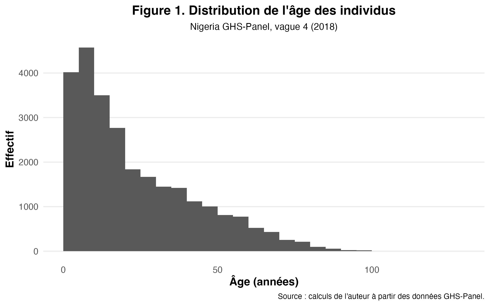
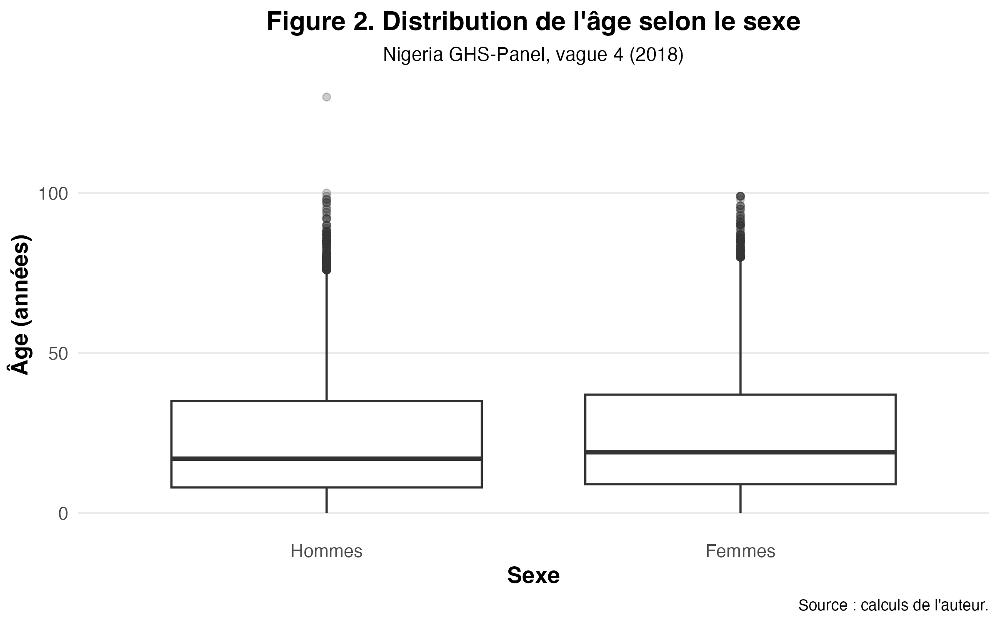
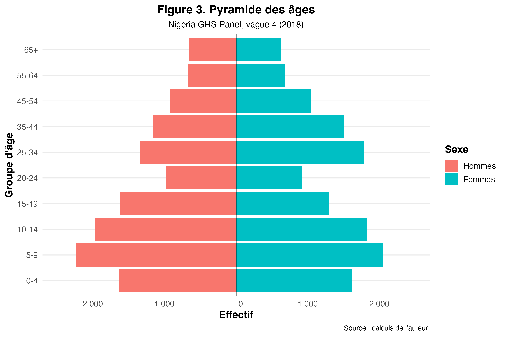
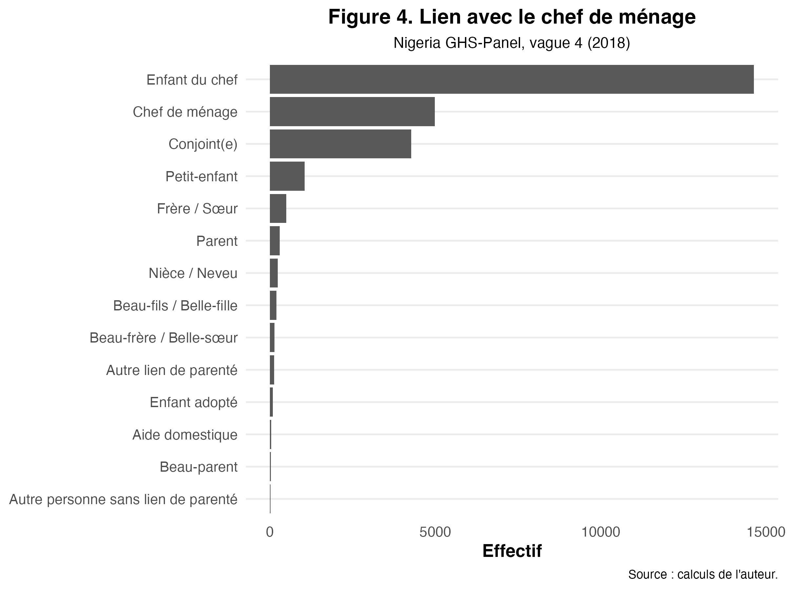
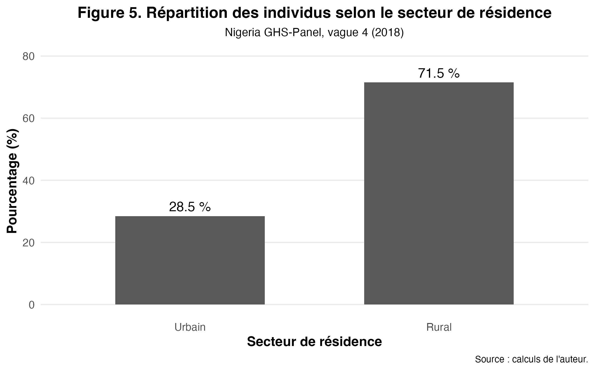
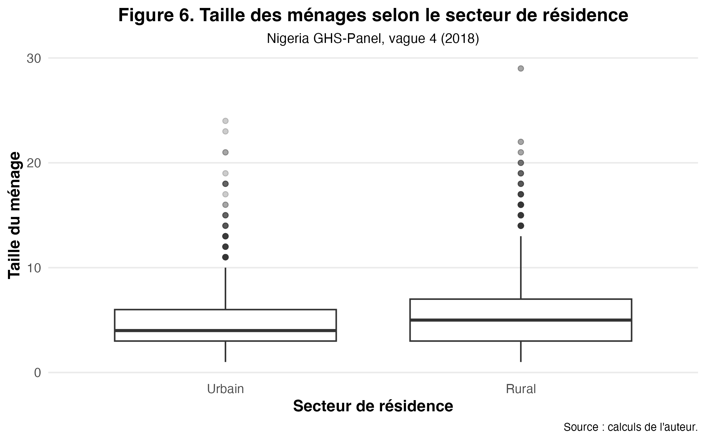

```{r}
# Installation automatique de TinyTeX si nécessaire
if (!requireNamespace("tinytex", quietly = TRUE)) {
  install.packages("tinytex")
}

if (!tinytex::is_tinytex()) {
  tinytex::install_tinytex()
}

library(knitr)

safe_read_csv <- function(path) {
  if (file.exists(path)) {
    read.csv(path, stringsAsFactors = FALSE)
  } else {
    NULL
  }
}

safe_read_text <- function(path) {
  if (file.exists(path)) {
    paste(readLines(path, warn = FALSE), collapse = "\n")
  } else {
    paste("Fichier introuvable :", path)
  }
}

safe_include_graphics <- function(path) {
  if (file.exists(path)) {
    knitr::include_graphics(path)
  } else {
    cat(paste("Figure introuvable :", path))
  }
}
```

# Introduction

Cette analyse décrit le profil démographique des ménages nigérians à partir des données du Nigeria General Household Survey Panel (GHS-Panel), vague 4 (2018).
Les données proviennent principalement du fichier sect1_harvestw4, contenant les caractéristiques individuelles des membres des ménages.

L’objectif est d’examiner la population selon :
l’âge
le sexe
le lien avec le chef de ménage
le secteur de résidence
la taille des ménages
Cette analyse constitue une première étape descriptive.

# 1. Données mobilisées et préparation

Les variables principales utilisées sont :
âge
sexe
lien de parenté avec le chef de ménage
secteur de résidence
Avant l’analyse plusieurs vérifications ont été réalisées :
contrôle de la structure des données
vérification des identifiants
analyse des valeurs manquantes

# 1.1 Valeurs manquantes

```{r}
missing_table <- safe_read_csv("../output/tables/analyse1/missing_summary_demo_raw.csv")

if(!is.null(missing_table)){
  kable(
    head(missing_table, 15),
    caption = "Extrait du tableau des valeurs manquantes",
    digits = 2
  )
} else {
  cat("Le fichier des valeurs manquantes est introuvable.")
}
```

## 1.2 Visualisation des valeurs manquantes

```{r}
safe_include_graphics("../output/figures/analyse1/vis_miss_demo_raw_sample.png")
```

# 2. Distribution de l’âge

## 2.1 Statistiques descriptives

```{r}
age_stats <- safe_read_csv("../output/tables/analyse1/age_stats_w4.csv")

if(!is.null(age_stats)){
  kable(
    age_stats,
    caption = "Statistiques descriptives de l’âge",
    digits = 2
  )
} else {
  cat("Fichier des statistiques d'âge introuvable.")
}
```

La population observée apparaît relativement jeune.

## 2.2 Histogramme de l’âge

```{r}
safe_
```

## 2.3 Test de normalité

```{r}
cat(safe_read_text("../output/tables/analyse1/shapiro_age_w4.txt"))
```

# 2.4 Distribution de l’âge selon le sexe

```{r}
safe_
```

# 3. Pyramide des âges

```{r}
safe_
```

La pyramide présente une structure démographique expansive, caractérisée par une base large.

# 4. Lien de parenté avec le chef de ménage

## 4.1 Tableau de fréquences

```{r}
tab_relation <- safe_read_csv("../output/tables/analyse1/tab_relation_head_w4.csv")

if(!is.null(tab_relation)){
  kable(
    tab_relation,
    caption = "Lien de parenté avec le chef de ménage",
    digits = 2
  )
} else {
  cat("Fichier relation chef de ménage introuvable.")
}
```

Les catégories dominantes sont :
enfants du chef de ménage
chefs de ménage
conjoints

## 4.2 Représentation graphique

```{r}
safe_
```

# 5. Secteur de résidence

## 5.1 Tableau de répartition

```{r}
tab_sector <- safe_read_csv("../output/tables/analyse1/tab_sector_w4.csv")

if(!is.null(tab_sector)){
  kable(
    tab_sector,
    caption = "Répartition selon le secteur de résidence",
    digits = 2
  )
} else {
  cat("Fichier secteur introuvable.")
}
```

## 5.2 Représentation graphique

```{r}
safe_
```

La majorité des individus de l’échantillon vit en milieu rural.

# 6. Taille des ménages

## 6.1 Statistiques descriptives

```{r}
hh_size_stats <- safe_read_csv("../output/tables/analyse1/hh_size_stats_by_sector_w4.csv")

if(!is.null(hh_size_stats)){
  kable(
    hh_size_stats,
    caption = "Taille des ménages selon le secteur",
    digits = 2
  )
} else {
  cat("Fichier taille ménage introuvable.")
}
```

## 6.2 Comparaison graphique

```{r}
safe_
```

## 6.3 Test de Wilcoxon

```{r}
cat(safe_read_text("../output/tables/analyse1/wilcox_hh_size_urban_rural.txt"))
```

## 6.4 Taille d’effet

```{r}
effet <- safe_read_csv("../output/tables/analyse1/wilcox_effsize_hh_size_urban_rural.csv")

if(!is.null(effet)){
  kable(
    effet,
    caption = "Taille d'effet du test de Wilcoxon",
    digits = 4
  )
} else {
  cat("Fichier effet Wilcoxon introuvable.")
}
```

# 7. Conclusion

Cette analyse descriptive met en évidence plusieurs caractéristiques importantes.
La population étudiée présente une structure démographique jeune, avec une forte proportion d’individus dans les classes d’âge basses.
La composition des ménages montre que les enfants du chef de ménage constituent la catégorie la plus représentée.
La population de l’échantillon est majoritairement rurale.
Enfin, les résultats suggèrent que les ménages ruraux sont en moyenne plus grands que les ménages urbains.
