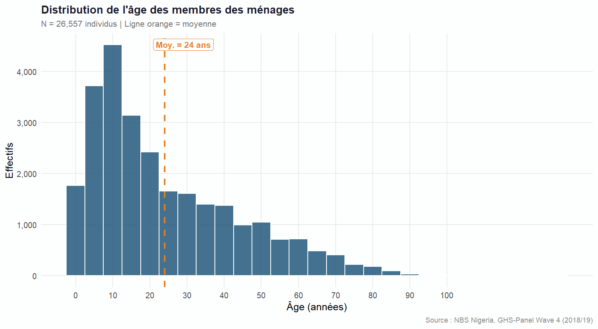
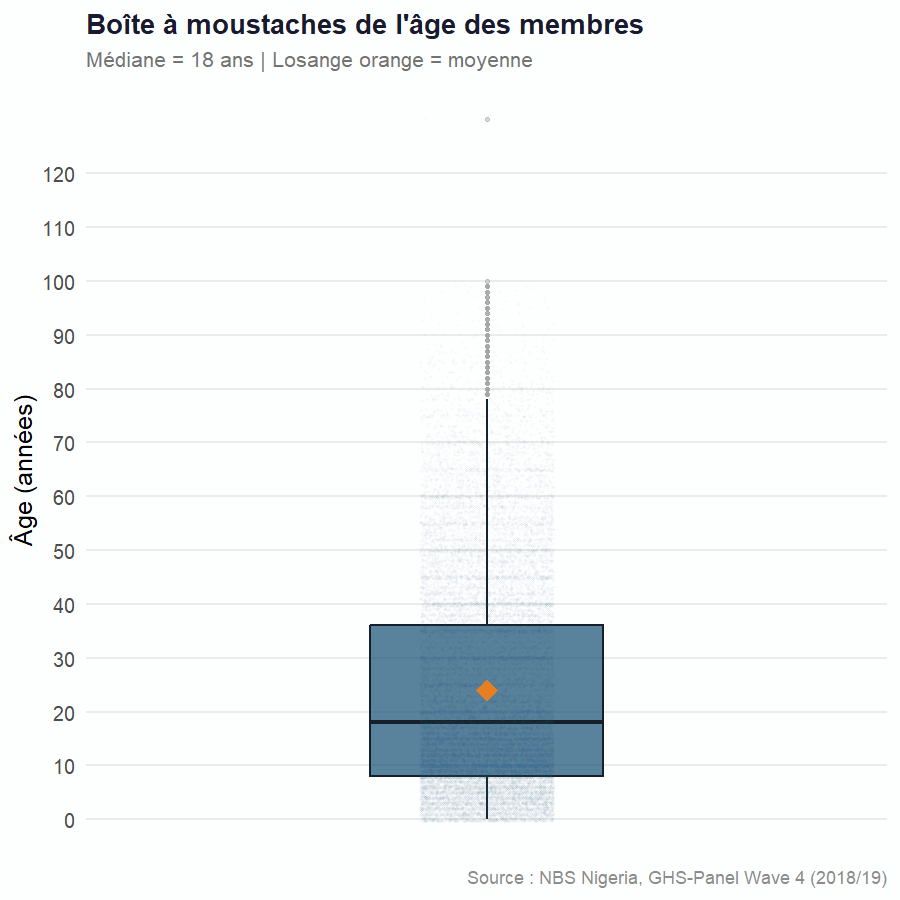
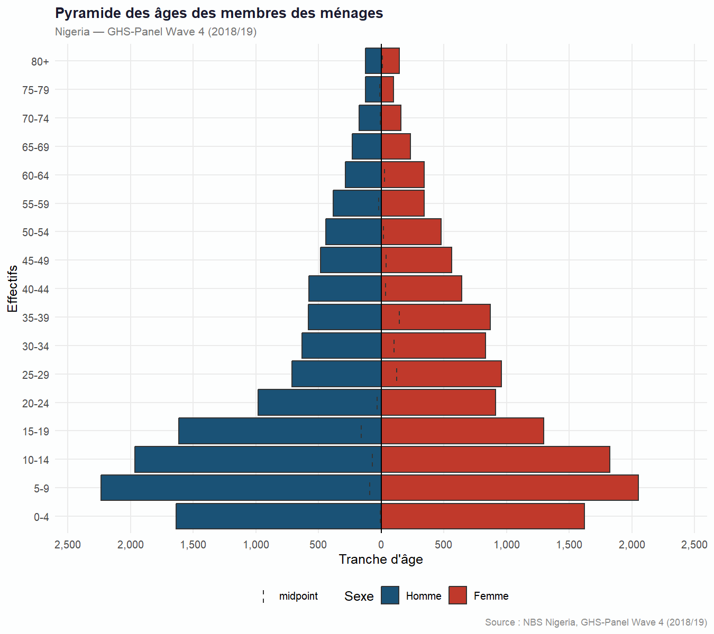
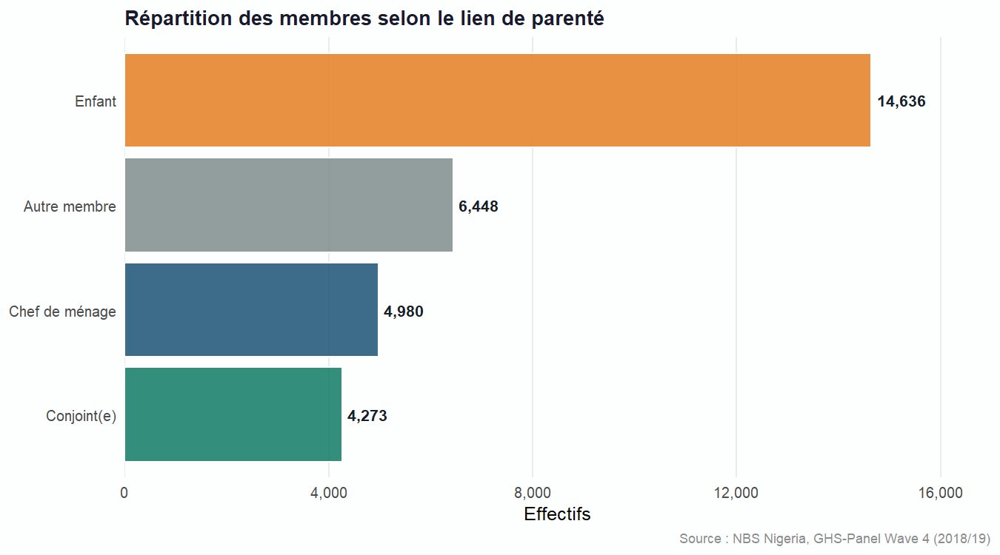
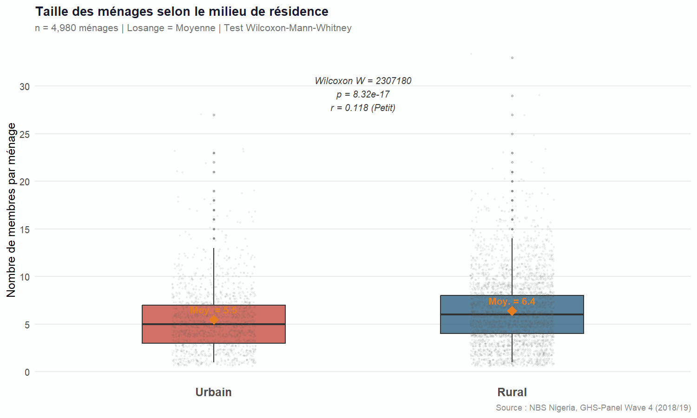

```{r setup, include=FALSE}
knitr::opts_chunk$set(
  echo      = FALSE,
  warning   = FALSE,
  message   = FALSE,
  fig.align = "center",
  out.width = "100%",
  fig.pos   = "H"
)
```

```{r valeurs, include=FALSE}
# ── Qualité des données ──────────────────────────────────────────
n_individus  <- 30337
n_menages    <- 4980
n_variables  <- 67
n_doublons   <- 0
pct_manq_age <- 12.46
n_manq_age   <- 3780

# ── Âge ─────────────────────────────────────────────────────────
age_moy  <- 23.98
age_med  <- 18
age_et   <- 19.73
age_min  <- 0
age_q1   <- 8
age_q3   <- 36
age_max  <- 130
sw_W     <- 0.937
sw_pval  <- "< 2,2e-16"

# ── Lien de parenté ──────────────────────────────────────────────
n_chef     <- 4980;  pct_chef     <- 16.42
n_conjoint <- 4273;  pct_conjoint <- 14.09
n_enfant   <- 14636; pct_enfant   <- 48.24
n_autre    <- 6448;  pct_autre    <- 21.25
ic_chef_low  <- 16.00; ic_chef_high  <- 16.84
ic_conj_low  <- 13.70; ic_conj_high  <- 14.48
ic_enf_low   <- 47.68; ic_enf_high   <- 48.81
ic_autre_low <- 20.80; ic_autre_high <- 21.72

# ── Taille des ménages ───────────────────────────────────────────
n_urb    <- 1595; n_rur    <- 3385
moy_urb  <- 5.47; moy_rur  <- 6.39
med_urb  <- 5;    med_rur  <- 6
q1_urb   <- 3;    q1_rur   <- 4
q3_urb   <- 7;    q3_rur   <- 8
et_urb   <- 3.26; et_rur   <- 3.75
max_urb  <- 27;   max_rur  <- 33
wilcox_W <- 2307180
wilcox_p <- "8,32e-17"
r_effet  <- 0.118
```

---

# Contexte et objectifs {-}

Le Nigeria est le pays le plus peuplé d'Afrique subsaharienne, avec une démographie
caractérisée par une croissance rapide, une structure par âge très jeune et des
contrastes marqués entre espaces ruraux et urbains. Comprendre la composition des
ménages constitue un préalable indispensable à toute analyse des conditions de vie
et des inégalités socio-économiques.

Ce rapport présente une analyse du **profil démographique des ménages** enquêtés dans
la vague 4 du Nigeria General Household Survey-Panel (GHSP-W4, 2018/2019), collecté
par le National Bureau of Statistics (NBS). Il est structuré en quatre parties :
(i) préparation et contrôle qualité des données, (ii) analyse univariée de l'âge,
(iii) étude du lien de parenté avec intervalles de confiance, et (iv) comparaison de
la taille des ménages entre milieux urbain et rural.

# Données et méthodologie

## Sources mobilisées

L'analyse repose principalement sur la section `sect1_harvestw4.dta`, enrichie par
les caractéristiques du ménage issues de `secta_harvestw4.dta`. La jointure est
réalisée sur l'identifiant ménage `hhid`.


```{r tab_manquants_1}

df_sources <- data.frame(
  Fichier = c("sect1_harvestw1/.../w4", "sect1_plantingw1/.../w4", "secta_harvestw1/.../w4"),
  Variables = c("indiv_id, s1q2 (sexe), s1q4 (âge), s1q1 (lien parenté)",
                "Mêmes variables, visite post-plantation",
                "hhid, zone (rural/urbain), état, LGA"),
  Vagues = c("W1 – W4", "W1 – W4", "W1 – W4")
)

knitr::kable(
  df_sources,
  col.names = c("Fichier .dta", "Variables clés", "Vagues disponibles"),
  caption   = "Sources mobilisées pour l'analyse."
)
```

## Méthodes statistiques

**Exploration et qualité.** La structure du fichier est examinée par `str()`,
`glimpse()` et `summary()`. Les doublons sur la clé composite `hhid + indiv_id`
sont contrôlés explicitement. Les valeurs manquantes sont visualisées par
`naniar::vis_miss()`.

**Analyse univariée de l'âge.** La distribution est décrite par la moyenne, la
médiane, les quartiles $Q_1$ et $Q_3$, l'écart-type et l'asymétrie. La normalité est
testée par le **test de Shapiro-Wilk** sur un sous-échantillon aléatoire de 5 000
individus. La pyramide des âges par groupes quinquennaux est produite avec le package
`apyramid`.

**Liens de parenté.** Les proportions sont accompagnées d'intervalles de confiance à
95% calculés par la méthode exacte de **Clopper-Pearson** (package `PropCIs`), plus
robuste que l'approximation normale pour les valeurs proches des bornes.

**Comparaison rural/urbain.** La non-normalité justifie le test non paramétrique de
**Wilcoxon-Mann-Whitney**. La taille d'effet est mesurée par le $r$ de Rosenthal :

$$r = \frac{|Z|}{\sqrt{n}}$$

**Tableau de synthèse.** Un tableau `gtsummary` stratifié par zone est produit pour
l'âge, le sexe et la taille du ménage, avec les p-valeurs des tests de comparaison
appropriés.

# Résultats

## Préparation et qualité des données

### Structure de la base

La base `sect1_harvestw4` contient **`r format(n_individus, big.mark = " ")` individus**
répartis dans **`r format(n_menages, big.mark = " ")` ménages**, décrits par
`r n_variables` variables. Les variables clés retenues sont l'âge (`s1q4`), le sexe
(`s1q2`), le lien de parenté (`s1q3`), le secteur de résidence (`sector`) et la zone
géographique (`zone`).

Un identifiant unique ménage × individu a été construit pour détecter les redondances :
l'inspection révèle **`r n_doublons` doublon**, ce qui confirme l'intégrité de la
structure individuelle de la base.

### Contrôle des valeurs manquantes


```{r tab_manquants}
df_miss <- data.frame(
  Variable  = c("Âge (s1q4)", "Sexe (s1q2)", "Secteur",
                "Lien de parenté", "Zone géographique"),
  Manquants = c(n_manq_age, n_manq_age, 0, 0, 0),
  Part      = c(pct_manq_age, pct_manq_age, 0.00, 0.00, 0.00)
)
knitr::kable(
  df_miss,
  col.names = c("Variable", "Manquants", "Part (%)"),
  caption   = "Valeurs manquantes par variable clé -- \\texttt{sect1\\_harvestw4}.",
  align     = c("l", "r", "r")
)
```

Les valeurs manquantes sont concentrées sur l'âge et le sexe (`r pct_manq_age`% chacun),
probablement liées aux membres absents lors du passage de l'enquêteur. Les variables
structurantes — identifiants, secteur, zone et lien de parenté — sont intégralement
renseignées, ce qui garantit la robustesse des analyses ultérieures.

## Analyse univariée de l'âge

### Statistiques descriptives

```{r tab_age}
df_age <- data.frame(
  Stat  = c("Moyenne", "Médiane", "Écart-type", "Min", "Q1", "Q3", "Max"),
  Val   = c(age_moy, age_med, age_et, age_min, age_q1, age_q3, age_max)
)
knitr::kable(
  df_age,
  col.names = c("Statistique", "Valeur (années)"),
  caption   = "Statistiques descriptives de l'âge des membres des ménages.",
  align     = c("l", "r")
)
```

La distribution présente une **moyenne de `r age_moy` ans** et une **médiane de
`r age_med` ans**. L'écart entre ces deux mesures révèle une **asymétrie à droite**
typique des populations à forte natalité : la présence d'individus âgés tire la
moyenne vers le haut, tandis que la médiane reflète la jeunesse effective de la
majorité des membres. L'écart-type de `r age_et` ans traduit une forte dispersion,
avec des âges allant de `r age_min` à `r age_max` ans.

### Histogramme

```{r fig1, fig.cap="Distribution de l'âge des membres des ménages -- histogramme avec moyenne (ligne pointillée). Source : Nigeria GHS Panel W4."}

```

L'histogramme confirme la concentration des effectifs dans les premières tranches
d'âge. La classe modale se situe entre 5 et 9 ans, et les effectifs décroissent de
façon quasi-monotone au-delà de 20 ans. Cette structure est caractéristique d'un
régime démographique expansif, à fécondité élevée et espérance de vie encore modérée.

### Boîte à moustaches

```{r fig2, fig.cap="Boîte à moustaches de la distribution de l'âge -- médiane et valeurs extrêmes. Source : Nigeria GHS Panel W4."}

```

La boîte à moustaches met en évidence la présence de valeurs extrêmes au-delà de
90 ans, sans remettre en cause la qualité des données. Ces observations correspondent
à des aînés intégrés dans des ménages élargis, phénomène courant dans le contexte
nigérian. La médiane (`r age_med` ans), nettement inférieure au troisième quartile
($Q_3$ = `r age_q3` ans), confirme l'asymétrie positive de la distribution.

### Test de normalité et pyramide des âges

Le test de Shapiro-Wilk, appliqué sur un sous-échantillon de 5 000 individus tirés
aléatoirement (graine fixée pour reproductibilité), confirme que la distribution est
**significativement non normale** ($W =$ `r sw_W` ; $p$ `r sw_pval`). Ce résultat
justifie le recours aux méthodes non paramétriques pour toutes les comparaisons
ultérieures.

```{r fig3, fig.cap="Pyramide des âges par groupes quinquennaux et par sexe -- Wave 4. Source : Nigeria GHS Panel W4."}

```

La pyramide des âges présente une **base large et un sommet étroit**, structure
classique des pays en développement à forte natalité. Les groupes 0--4 ans et 5--9 ans
constituent les cohortes les plus larges. Les effectifs masculins et féminins sont
globalement équilibrés sur l'ensemble des tranches d'âge, avec une légère
surreprésentation féminine aux grands âges, phénomène habituel lié à la surmortalité
masculine.

## Lien de parenté et intervalles de confiance

### Fréquences observées

```{r fig4, fig.cap="Fréquence du lien de parenté avec le chef de ménage (ordonné par effectif décroissant). Source : Nigeria GHS Panel W4."}

```

Quatre catégories ont été distinguées : chef de ménage, conjoint(e), enfant et autre.
Les **enfants constituent la catégorie dominante** avec 14 636 individus, résultat
cohérent avec la pyramide des âges à base large. La catégorie « autre » (6 448
individus) regroupe principalement les membres de la famille élargie, témoignant de la
prédominance des ménages élargis dans le contexte nigérian.

### Proportions avec intervalles de confiance (Clopper-Pearson)

```{r tab_parente}
df_par <- data.frame(
  Cat  = c("Chef de ménage", "Conjoint(e)", "Enfant", "Autre"),
  N    = c(n_chef, n_conjoint, n_enfant, n_autre),
  Pct  = c(pct_chef, pct_conjoint, pct_enfant, pct_autre),
  Low  = c(ic_chef_low, ic_conj_low, ic_enf_low, ic_autre_low),
  High = c(ic_chef_high, ic_conj_high, ic_enf_high, ic_autre_high)
)
knitr::kable(
  df_par,
  col.names = c("Catégorie", "Effectif", "Proportion (%)",
                "IC inf. 95% (%)", "IC sup. 95% (%)"),
  caption   = "Proportions par catégorie de parenté avec IC 95% exact (Clopper-Pearson).",
  align     = c("l", "r", "r", "r", "r")
)
```

Les intervalles de confiance sont très étroits grâce à la grande taille de l'échantillon,
conférant une haute précision aux estimations. Les enfants représentent près de la moitié
des membres (`r pct_enfant`% ; IC 95% : [`r ic_enf_low`% -- `r ic_enf_high`%]).
Le nombre de chefs de ménage (`r pct_chef`%) coïncide exactement avec le nombre de
ménages, attestant de la cohérence interne de la base. La proportion de conjoints
(`r pct_conjoint`%), inférieure à celle des chefs de ménage, reflète la présence de
ménages monoparentaux dans l'échantillon.

## Taille des ménages : comparaison urbain/rural

### Statistiques descriptives par secteur

```{r tab_taille}
df_tail <- data.frame(
  Sect = c("Urbain", "Rural"),
  N    = c(n_urb, n_rur),
  Moy  = c(moy_urb, moy_rur),
  Med  = c(med_urb, med_rur),
  Q1   = c(q1_urb, q1_rur),
  Q3   = c(q3_urb, q3_rur),
  Et   = c(et_urb, et_rur),
  Max  = c(max_urb, max_rur)
)
knitr::kable(
  df_tail,
  col.names = c("Secteur", "N ménages", "Moyenne", "Médiane",
                "Q1", "Q3", "Éc.-type", "Max"),
  caption   = "Taille des ménages par secteur de résidence.",
  align     = c("l", rep("r", 7))
)
```

Les ménages ruraux présentent une taille médiane de **`r med_rur` membres** contre
**`r med_urb` membres** en milieu urbain. La moyenne rurale (`r moy_rur`) dépasse
également la moyenne urbaine (`r moy_urb`). Cette différence reflète des logiques
d'organisation familiale distinctes : en milieu rural, la cohabitation
intergénérationnelle et les besoins de main-d'œuvre agricole favorisent des ménages
plus larges.

### Test de Wilcoxon-Mann-Whitney

```{r fig5, fig.cap="Taille des ménages par secteur de résidence -- boxplot groupé avec annotation du test de Wilcoxon-Mann-Whitney. Source : Nigeria GHS Panel W4."}

```

```{r tab_wilcox}
df_wil <- data.frame(
  Stat = c("Statistique W", "p-valeur",
           "IC 95% (différence de localisation)",
           "Taille d'effet r de rang",
           "Interprétation"),
  Val  = c(format(wilcox_W, big.mark = " "),
           wilcox_p, "[-1 ; -1]", r_effet, "Petit")
)
knitr::kable(
  df_wil,
  col.names = c("Statistique", "Valeur"),
  caption   = "Résultats du test de Wilcoxon-Mann-Whitney (taille des ménages urbain vs rural).",
  align     = c("l", "r")
)
```

La p-valeur ($p =$ `r wilcox_p`) est très inférieure au seuil de 5%, conduisant au
**rejet de l'hypothèse nulle** d'égalité des distributions. La différence est donc
**hautement significative sur le plan statistique**. Toutefois, la taille d'effet
$r =$ `r r_effet` est qualifiée de **petite** : si la différence est réelle et
détectable, son amplitude reste modeste à l'échelle individuelle, les deux milieux
présentant une grande hétérogénéité interne (étendues de 1 à `r max_urb` en urbain,
1 à `r max_rur` en rural).


# Synthèse

```{r tab_synthese}
df_synth <- data.frame(
  Ind = c(
    "Taille de l'échantillon",
    "Nombre de ménages",
    "Doublons détectés",
    "Valeurs manquantes -- Âge",
    "Âge moyen (écart-type)",
    "Âge médian [Q1 ; Q3]",
    "Test de normalité (Shapiro-Wilk)",
    "Catégorie de parenté dominante",
    "Proportion d'enfants (IC 95%)",
    "Taille médiane -- Urbain / Rural",
    "Test Wilcoxon (taille ménage)",
    "Taille d'effet r de rang"
  ),
  Val = c(
    paste0(format(n_individus, big.mark = " "), " individus"),
    paste0(format(n_menages, big.mark = " "), " ménages"),
    "0",
    paste0(format(n_manq_age, big.mark = " "), " (", pct_manq_age, "%)"),
    paste0(age_moy, " ans (", age_et, ")"),
    paste0(age_med, " ans [", age_q1, " ; ", age_q3, "]"),
    paste0("W = ", sw_W, " ; p ", sw_pval, " → non normale"),
    paste0("Enfant (", pct_enfant, "%)"),
    paste0(pct_enfant, "% [", ic_enf_low, "% – ", ic_enf_high, "%]"),
    paste0(med_urb, " / ", med_rur, " membres"),
    paste0("W = ", format(wilcox_W, big.mark = " "), " ; p = ", wilcox_p),
    paste0(r_effet, " (petit)")
  )
)
knitr::kable(
  df_synth,
  col.names = c("Indicateur", "Résultat"),
  caption   = "Récapitulatif des principaux résultats -- Nigeria GHS Panel W4 (2018/2019)."
)
```

Cette analyse conduit à quatre constats principaux :

**1. Une base de données de qualité satisfaisante.** L'absence totale de doublons et
l'intégrité des variables structurantes garantissent la fiabilité des estimations.
Les valeurs manquantes sur l'âge (12,46%) méritent attention mais n'affectent pas
les analyses portant sur les autres variables.

**2. Une structure démographique jeune.** Avec une médiane à `r age_med` ans et une
pyramide à large base, la population enquêtée reflète le profil démographique typique
du Nigeria. La distribution d'âge est significativement non normale, ce qui impose
le recours aux méthodes non paramétriques pour toute comparaison.

**3. Une composition familiale dominée par les enfants et la famille élargie.**
Les enfants représentent près de la moitié des membres enquêtés (`r pct_enfant`%),
et la catégorie « autre » (21,25%) témoigne de la prégnance des ménages élargis,
structures cohérentes avec les normes sociales et les conditions économiques du
contexte nigérian.

**4. Des ménages ruraux significativement plus grands que les ménages urbains.**
La différence de taille médiane (`r med_rur` vs `r med_urb` membres) est hautement
significative statistiquement ($p =$ `r wilcox_p`), mais d'amplitude modeste
($r =$ `r r_effet`). Elle reflète des logiques d'organisation familiale contrastées,
davantage liées aux besoins agricoles et aux solidarités communautaires rurales qu'à
de simples différences de niveau de vie.

# Références {-}

- National Bureau of Statistics (NBS) Nigeria (2019). *General Household Survey-Panel
  Wave 4, 2018/2019*. Programme LSMS-ISA. Washington DC : Banque Mondiale.

- Clopper, C.J. & Pearson, E.S. (1934). The use of confidence or fiducial limits
  illustrated in the case of the binomial. *Biometrika*, 26(4), 404--413.

- Wilcoxon, F. (1945). Individual comparisons by ranking methods.
  *Biometrics Bulletin*, 1(6), 80--83.

- Cohen, J. (1988). *Statistical Power Analysis for the Behavioral Sciences*
  (2e éd.). Hillsdale : Lawrence Erlbaum Associates.

---

*Rapport produit avec R Markdown dans le cadre du cours de Projet Statistique
sous R et Python -- ENSAE Pierre Ndiaye, 2025-2026.*
