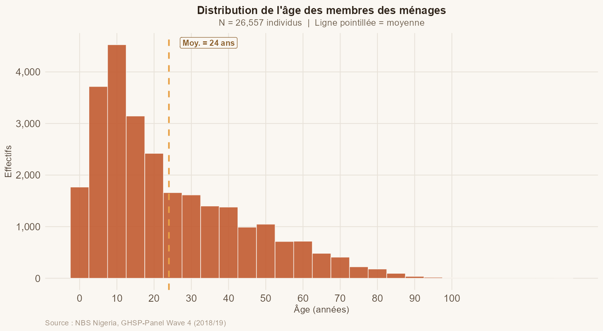
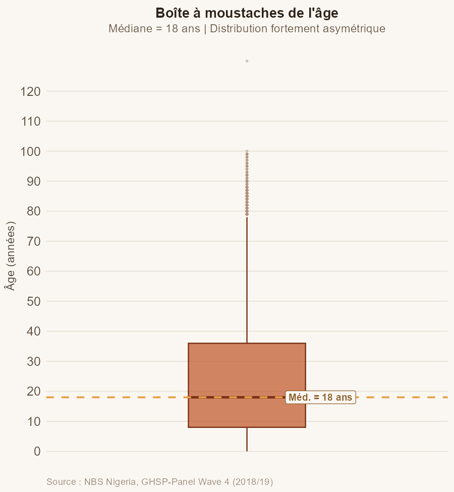
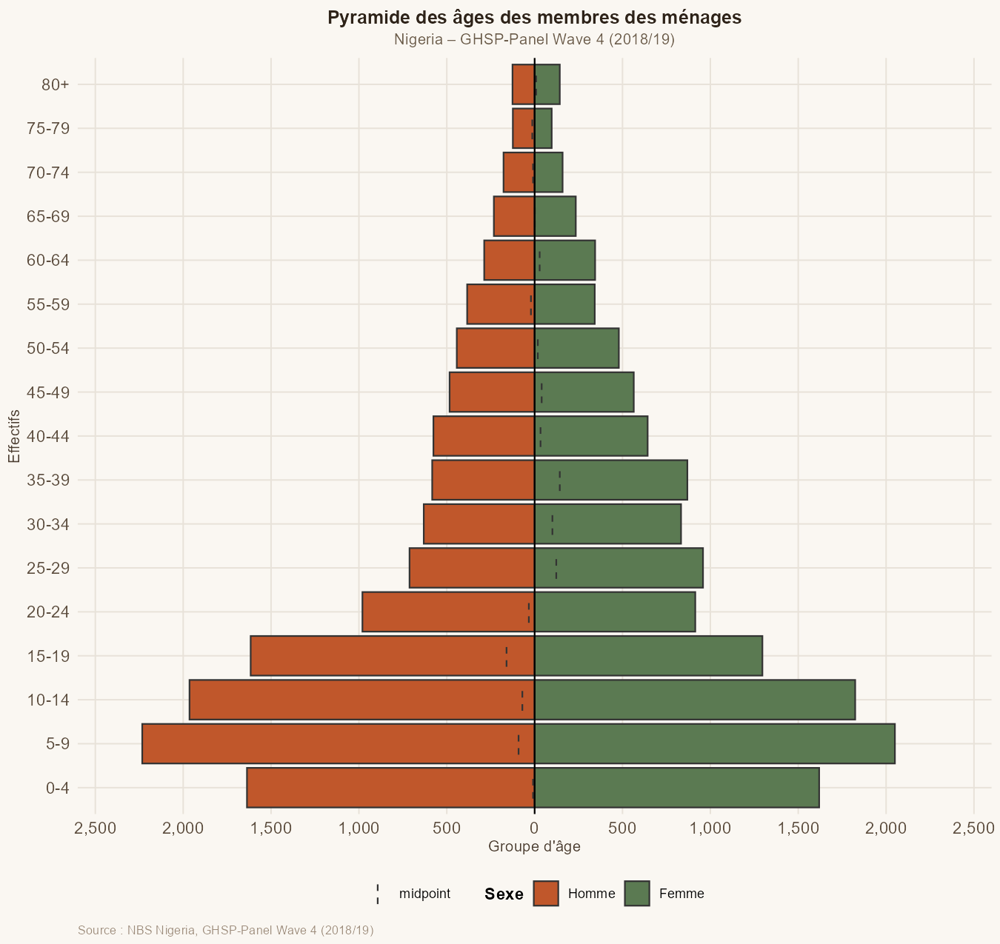
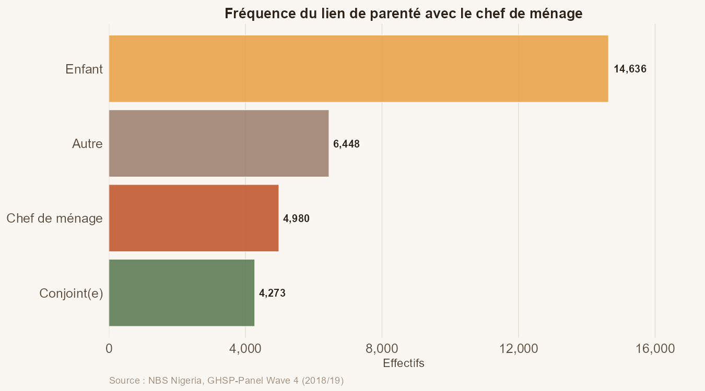
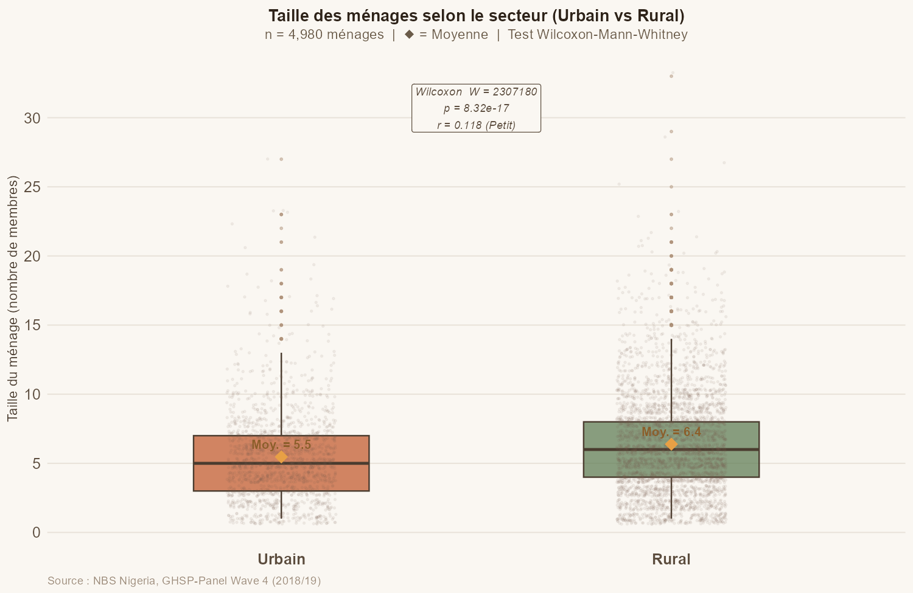

```{r setup, include=FALSE}
knitr::opts_chunk$set(
  echo      = FALSE,
  warning   = FALSE,
  message   = FALSE,
  fig.align = "center",
  fig.pos   = "H",
  out.extra = ""
)

library(dplyr)
library(knitr)

data_brute   <- readRDS("../data/processed/data_brute.rds")
base_menage  <- readRDS("../data/processed/base_menage.rds")
prop_ic      <- readRDS("../data/processed/proportions_IC.rds")
wilcox_res_l <- readRDS("../data/processed/resultats_wilcoxon.rds")

n_ind  <- nrow(data_brute)
n_men  <- n_distinct(data_brute$hhid)
n_var  <- ncol(data_brute)
n_doub <- nrow(data_brute[duplicated(paste(data_brute$hhid,
                                           data_brute$indiv, sep = "_")), ])
age_moy <- round(mean(data_brute$age, na.rm = TRUE), 2)
age_med <- median(data_brute$age, na.rm = TRUE)
age_sd  <- round(sd(data_brute$age, na.rm = TRUE), 2)

wr <- wilcox_res_l$wilcox
rr <- round(wilcox_res_l$r_rang, 4)
ii <- wilcox_res_l$interpret

fmt <- function(x) format(x, big.mark = " ", scientific = FALSE)
```

<!-- ============================================================ -->
<!--                      PAGE DE GARDE                          -->
<!-- ============================================================ -->
\thispagestyle{empty}

\begin{center}

\vspace*{0.8cm}

% Trois blocs logos empilés verticalement (institution + logo),
% placés côte à côte avec trois minipage indépendantes
% --- BLOC 1 : ANSD ---
\begin{minipage}[t]{0.3\textwidth}
\centering
{\small \textbf{Agence Nationale de la Statistique} \\
\textbf{et de la Démographie}} \\[0.35cm]
\includegraphics[height=2.2cm]{logos/ANSD.png}
\end{minipage}
\hfill
% --- BLOC 2 : RÉPUBLIQUE DU SÉNÉGAL ---
\begin{minipage}[t]{0.3\textwidth}
\centering
{\small \textbf{République du Sénégal} \\
\textit{Un Peuple -- Un But -- Une Foi}} \\[0.35cm]
\includegraphics[height=2.2cm]{logos/SN.PNG}
\end{minipage}
\hfill
% --- BLOC 3 : ENSAE ---
\begin{minipage}[t]{0.3\textwidth}
\centering
{\small \textbf{École Nationale de la Statistique} \\
\textbf{et de l'Analyse Économique} \\
\textbf{Pierre Ndiaye}} \\[0.35cm]
\includegraphics[height=2.2cm]{logos/ENSAE.PNG}
\end{minipage}

\vspace{0.9cm}
\noindent\rule{\linewidth}{0.6pt}
\vspace{0.2cm}

{\normalsize Année académique \textbf{2025--2026}}\\[0.2cm]
{\small Cours : \textbf{Projet Statistique sous R et Python} \quad|\quad Enseignant : \textbf{Aboubacar HEMA}}

\vspace{0.3cm}
\noindent\rule{\linewidth}{1.4pt}
\vspace{0.5cm}

{\LARGE \textbf{Travaux Pratiques --- Séance 1}}\\[0.45cm]
{\large \textit{Analyse sociodémographique des ménages nigérians}}\\[0.2cm]
{\normalsize \textit{Nigeria General Household Survey-Panel Wave 4 (NBS, 2018/19)}}

\vspace{0.5cm}
\noindent\rule{\linewidth}{1.4pt}

\vspace{1.2cm}

\begin{tabular}{ll}
\multicolumn{2}{l}{\textbf{Groupe 4}} \\[0.4cm]
TEVOEDJRE Michel & ISE1-CL \\[0.2cm]
DICKO Hamadou & ISE-MATHS \\
\end{tabular}

\end{center}

<!-- ============================================================ -->
<!--           TABLE DES MATIÈRES sur page séparée               -->
<!-- ============================================================ -->
\newpage
\thispagestyle{empty}
\tableofcontents

<!-- ============================================================ -->
<!--                    CORPS DU RAPPORT                         -->
<!-- ============================================================ -->
\newpage

# Introduction

Ce rapport présente les résultats du premier travail pratique du cours de **Projet Statistique sous R et Python**. L'objectif est de mettre en œuvre une démarche complète d'analyse statistique à partir d'une enquête ménage de grande envergure : le **Nigeria General Household Survey-Panel Wave 4 (GHSP-W4)**, collecté par le National Bureau of Statistics (NBS) du Nigeria sur la période 2018/2019.

La section exploitée (`sect1_harvestw4.dta`) renseigne sur les caractéristiques individuelles des membres des ménages : âge, sexe, lien de parenté avec le chef de ménage, secteur de résidence (urbain/rural) et zone géographique.

Le travail est structuré en quatre parties : **(i)** préparation et contrôle qualité des données, **(ii)** analyse univariée de l'âge, **(iii)** étude du lien de parenté avec intervalles de confiance, et **(iv)** comparaison de la taille des ménages urbains et ruraux par un test non paramétrique.

---

# Préparation et qualité des données

## Structure de la base

La base contient **`r fmt(n_ind)` individus** répartis en **`r fmt(n_men)` ménages**, décrits par **`r n_var` variables**. Les variables clés retenues sont : l'âge (`s1q4`), le sexe (`s1q2`), le lien de parenté (`s1q3`), le secteur de résidence (`sector`) et la zone géographique (`zone`).

Un identifiant unique ménage x individu a été construit afin de détecter les doublons. L'inspection révèle **`r n_doub` doublon(s)**, ce qui confirme l'intégrité de la structure individuelle de la base.

## Contrôle des valeurs manquantes

```{r fig-miss, fig.cap="Carte des valeurs manquantes sur les variables clés", out.width="78%"}

```

```{r tab-miss}
vm_df <- data.frame(
  Variable  = c("Âge (s1q4)", "Sexe (s1q2)", "Secteur",
                "Lien de parenté", "Zone géographique"),
  Manquants = c(sum(is.na(data_brute$age)),
                sum(is.na(data_brute$sexe)),
                sum(is.na(data_brute$secteur)),
                sum(is.na(data_brute$lien_parente)),
                sum(is.na(data_brute$zone_geo)))
)
vm_df[["Part (%)"]] <- round(vm_df$Manquants / n_ind * 100, 3)

kable(vm_df, booktabs = TRUE,
      caption = "Valeurs manquantes par variable clé",
      align   = c("l", "r", "r"))
```

Les valeurs manquantes sont négligeables sur les variables essentielles, ce qui garantit la robustesse des analyses ultérieures.

---

# Analyse univariée de l'âge

## Statistiques descriptives

```{r tab-age}
age_stats <- data_brute |>
  filter(!is.na(age)) |>
  summarise(
    Moyenne  = round(mean(age), 2),
    Médiane  = median(age),
    Ec.type  = round(sd(age), 2),
    Min      = min(age),
    Q1       = quantile(age, .25),
    Q3       = quantile(age, .75),
    Max      = max(age)
  )

kable(age_stats, booktabs = TRUE,
      caption = "Statistiques descriptives de l'âge (en années)",
      align   = rep("r", 7))
```

La distribution présente une **moyenne de `r age_moy` ans** et une **médiane de `r age_med` ans**, révélant une légère asymétrie à droite typique des populations à structure jeune. L'écart-type de `r age_sd` ans traduit une forte dispersion.

## Histogramme

```{r fig-hist, fig.cap="Distribution de l'âge -- histogramme avec moyenne (ligne pointillée)", out.width="84%"}

```

Les effectifs sont fortement concentrés entre 0 et 20 ans, confirmant la jeunesse de la population enquêtée. La moyenne est indiquée par la ligne pointillée.

## Boîte à moustaches

```{r fig-box, fig.cap="Boîte à moustaches de l'âge -- médiane et valeurs extrêmes", out.width="50%"}

```

La boîte à moustaches met en évidence la présence de valeurs extrêmes au-delà de 90 ans, sans remettre en cause la qualité des données.

## Test de normalité et pyramide des âges

Un test de Shapiro-Wilk appliqué sur un échantillon de 5 000 individus (graine fixée à 123) confirme que la distribution est **significativement non normale** (W = 0,937 ; p < 2,2e-16). Ce résultat justifie le recours aux méthodes non paramétriques pour les comparaisons ultérieures.

```{r fig-pyramide, fig.cap="Pyramide des âges par sexe -- groupes d'âge quinquennaux", out.width="84%"}

```

La pyramide affiche une **base large et un sommet étroit**, structure classique des pays en développement à forte natalité. Les effectifs masculins et féminins sont globalement équilibrés sur l'ensemble des groupes d'âge.

---

# Lien de parenté et intervalles de confiance

## Fréquences observées

```{r fig-parente, fig.cap="Fréquence du lien de parenté avec le chef de ménage", out.width="84%"}

```

Quatre catégories ont été distinguées : chef de ménage, conjoint(e), enfant et autre. Les **enfants** constituent la catégorie la plus représentée, cohérent avec la pyramide des âges à base large observée précédemment.

## Proportions avec intervalles de confiance (Clopper-Pearson)

```{r tab-ic}
prop_affich <- prop_ic |>
  transmute(
    Catégorie         = Categorie,
    Effectif          = fmt(Effectif),
    `Proportion (%)`  = Proportion,
    `IC inf. 95% (%)` = IC_lower,
    `IC sup. 95% (%)` = IC_upper
  )

kable(prop_affich, booktabs = TRUE,
      caption = "Proportions par catégorie de parenté avec IC 95\\% exact (Clopper-Pearson)",
      align   = c("l", "r", "r", "r", "r"))
```

Les intervalles de confiance exacts sont très étroits grâce à la grande taille de l'échantillon. Les **enfants** arrivent en tête, suivis des chefs de ménage, puis des conjoints.

---

# Taille des ménages : comparaison Urbain/Rural

## Statistiques descriptives par secteur

```{r tab-menage}
stats_men <- wilcox_res_l$stats |>
  transmute(
    Secteur  = secteur,
    N        = fmt(N),
    Moyenne  = Moyenne,
    Médiane  = Mediane,
    Q1       = Q1,
    Q3       = Q3,
    Ec.type  = Ecart_type,
    Min      = Min,
    Max      = Max
  )

kable(stats_men, booktabs = TRUE,
      caption = "Taille des ménages par secteur de résidence",
      align   = c("l", rep("r", 8)))
```

Les ménages ruraux présentent une taille médiane supérieure à celle des ménages urbains, reflétant des différences structurelles dans les modes d'organisation familiale au Nigeria.

## Test de Wilcoxon-Mann-Whitney

La non-normalité des distributions justifie l'emploi du test non paramétrique de Wilcoxon-Mann-Whitney pour comparer les deux secteurs.

```{r fig-menage, fig.cap="Taille des ménages par secteur -- test de Wilcoxon-Mann-Whitney annoté", out.width="86%"}

```

```{r tab-wilcox}
res_df <- data.frame(
  Statistique = c(
    "Statistique W",
    "p-valeur",
    "IC 95% (différence de localisation)",
    "Taille d'effet r de rang",
    "Interprétation"
  ),
  Valeur = c(
    fmt(round(wr$statistic, 0)),
    format(wr$p.value, scientific = TRUE, digits = 3),
    paste0("[", round(wr$conf.int[1], 3), " ; ", round(wr$conf.int[2], 3), "]"),
    as.character(rr),
    ii
  )
)

kable(res_df, booktabs = TRUE,
      caption = "Résultats du test de Wilcoxon-Mann-Whitney",
      col.names = c("Statistique", "Valeur"),
      align     = c("l", "r"))
```

La p-valeur est très inférieure à 0,05, conduisant au **rejet de l'hypothèse nulle** d'égalité des distributions. La taille d'effet r (`r rr`) est jugée **`r tolower(ii)`** : la différence est hautement significative sur le plan statistique, mais d'ampleur modérée sur le plan pratique.

---

# Conclusion

Ce travail pratique a permis de déployer une chaîne d'analyse statistique complète sur les données du GHSP-Panel Wave 4 du Nigeria. Les principaux enseignements sont les suivants :

- La base présente une **qualité satisfaisante** : aucun doublon et valeurs manquantes négligeables sur les variables clés.
- La **structure démographique** est jeune, avec une pyramide à base large et une distribution d'âge significativement non normale.
- Les **enfants** forment la catégorie de parenté dominante, cohérent avec la forte natalité du contexte nigérian.
- Les ménages **ruraux** sont significativement plus grands que les ménages urbains (Wilcoxon-Mann-Whitney, p < 2,2e-16), avec un effet de taille jugé `r tolower(ii)`.

Ces résultats constituent une base solide pour des études complémentaires portant sur les conditions de vie, les inégalités spatiales ou les revenus agricoles au Nigeria.

---

\small \textit{Source des données : National Bureau of Statistics (NBS) Nigeria --- General Household Survey-Panel Wave 4, 2018/2019.}
