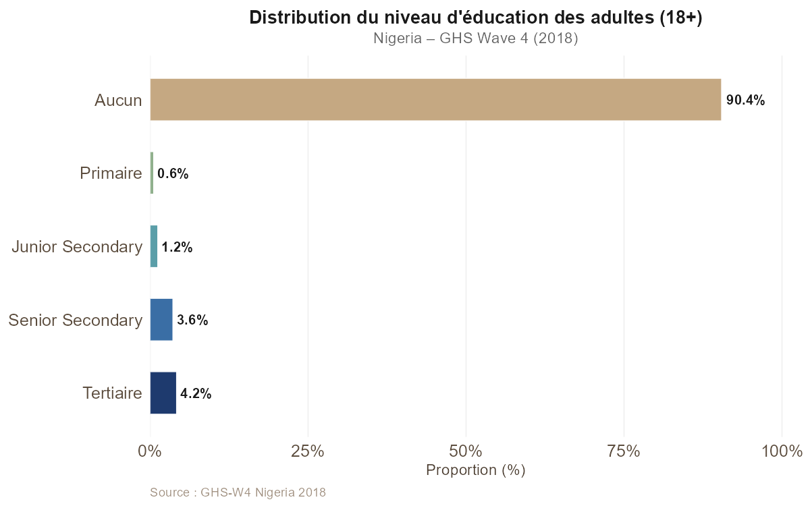
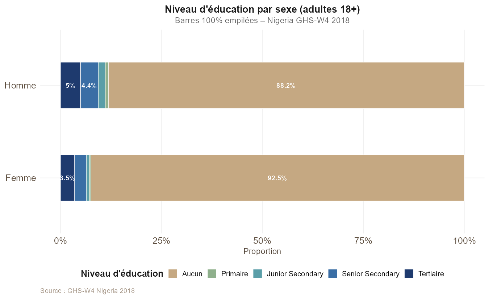
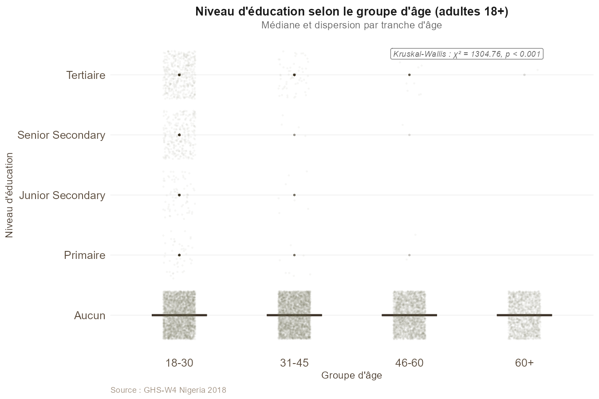
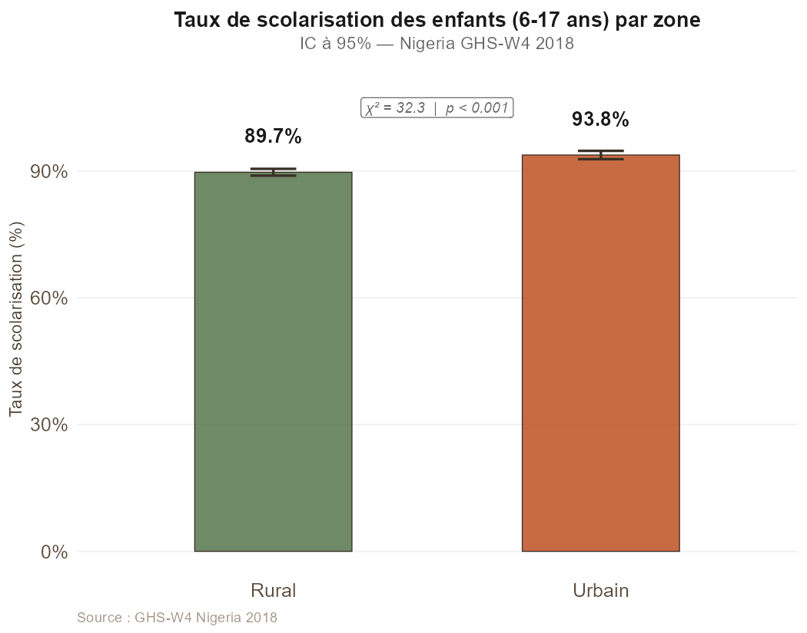
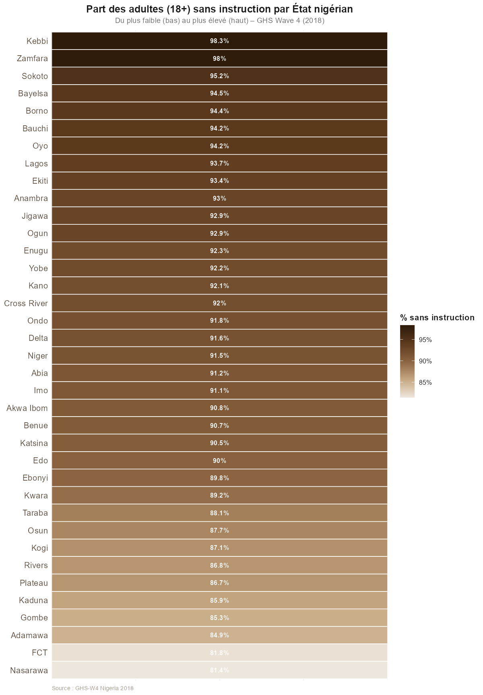
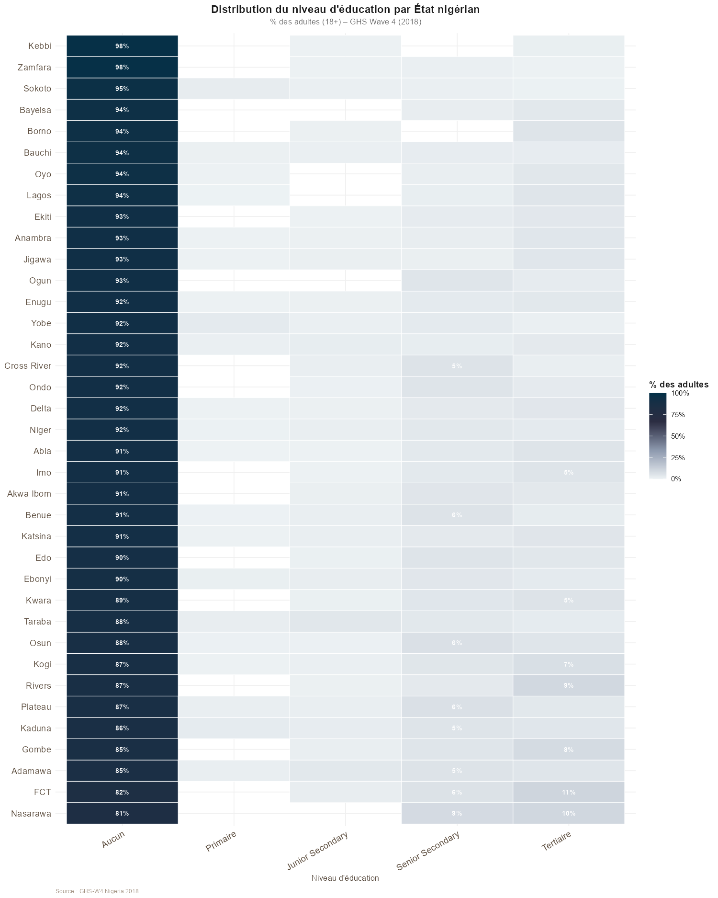

```{r setup, include=FALSE}
knitr::opts_chunk$set(
  echo      = FALSE,
  warning   = FALSE,
  message   = FALSE,
  fig.align = "center",
  fig.pos   = "H",
  out.extra = ""
)

library(dplyr)
library(knitr)

df_adultes <- readRDS("../data/processed/df_adultes.rds")
df_educ    <- readRDS("../data/processed/df_educ.rds")
df_scol    <- readRDS("../data/processed/df_scol.rds")
res_t9     <- readRDS("../data/processed/resultats_tache9.rds")
res_t10    <- readRDS("../data/processed/resultats_tache10.rds")
res_t11    <- readRDS("../data/processed/resultats_tache11.rds")
df_heatmap <- readRDS("../data/processed/df_heatmap.rds")

n_educ    <- nrow(df_educ)
n_adultes <- nrow(df_adultes)
n_men     <- n_distinct(df_educ$hhid)

chi2_val  <- round(res_t9$chi2$statistic, 2)
chi2_p    <- format(res_t9$chi2$p.value, scientific = TRUE, digits = 3)
v_cr      <- round(res_t9$v_cramer, 3)

kw_val    <- round(res_t10$kruskal$statistic, 2)

chi2_scol <- round(res_t11$chi2$statistic, 1)
taux_urb  <- round(res_t11$taux$prop[res_t11$taux$zone_scol == "Urbain"] * 100, 1)
taux_rur  <- round(res_t11$taux$prop[res_t11$taux$zone_scol == "Rural"]  * 100, 1)

top5_etats <- df_heatmap |>
  arrange(desc(part_aucun)) |>
  head(5) |>
  pull(state_name) |>
  paste(collapse = ", ")

fmt <- function(x) format(x, big.mark = " ", scientific = FALSE)
```

<!-- ============================================================ -->
<!--                      PAGE DE GARDE                          -->
<!-- ============================================================ -->
\thispagestyle{empty}

\begin{center}

\vspace*{0.8cm}

\begin{minipage}[t]{0.3\textwidth}
\centering
{\small \textbf{Agence Nationale de la Statistique} \\
\textbf{et de la Démographie}} \\[0.35cm]
\includegraphics[height=2.2cm]{logos/ANSD.png}
\end{minipage}
\hfill
\begin{minipage}[t]{0.3\textwidth}
\centering
{\small \textbf{République du Sénégal} \\
\textit{Un Peuple -- Un But -- Une Foi}} \\[0.35cm]
\includegraphics[height=2.2cm]{logos/SN.PNG}
\end{minipage}
\hfill
\begin{minipage}[t]{0.3\textwidth}
\centering
{\small \textbf{École Nationale de la Statistique} \\
\textbf{et de l'Analyse Économique} \\
\textbf{Pierre Ndiaye}} \\[0.35cm]
\includegraphics[height=2.2cm]{logos/ENSAE.PNG}
\end{minipage}

\vspace{0.9cm}
\noindent\rule{\linewidth}{0.6pt}
\vspace{0.2cm}

{\normalsize Année académique \textbf{2025--2026}}\\[0.2cm]
{\small Cours : \textbf{Projet Statistique sous R et Python} \quad|\quad Enseignant : \textbf{Aboubacar HEMA}}

\vspace{0.3cm}
\noindent\rule{\linewidth}{1.4pt}
\vspace{0.5cm}

{\LARGE \textbf{Travaux Pratiques --- Séance 2}}\\[0.45cm]
{\large \textit{Éducation et alphabétisation des membres des ménages au Nigeria}}\\[0.2cm]
{\normalsize \textit{Nigeria General Household Survey-Panel Wave 4 (NBS, 2018/19)}}

\vspace{0.5cm}
\noindent\rule{\linewidth}{1.4pt}

\vspace{1.2cm}

\begin{tabular}{ll}
\multicolumn{2}{l}{\textbf{Groupe 4}} \\[0.4cm]
TEVOEDJRE Michel & ISE1-CL \\[0.2cm]
DICKO Hamadou & ISE-MATHS \\
\end{tabular}

\end{center}

<!-- ============================================================ -->
<!--           TABLE DES MATIÈRES sur page séparée               -->
<!-- ============================================================ -->
\newpage
\thispagestyle{empty}
\tableofcontents

<!-- ============================================================ -->
<!--                    CORPS DU RAPPORT                         -->
<!-- ============================================================ -->
\newpage

# Introduction

Ce rapport présente les résultats du second travail pratique du cours de **Projet Statistique sous R et Python**. L'objectif est d'analyser les **niveaux d'instruction** et les **taux de scolarisation** des membres des ménages au Nigeria, à partir des sections éducation de la *General Household Survey* (GHS) --- vague 4 (2018), conduite par la Banque Mondiale en collaboration avec le Bureau National des Statistiques nigérien (NBS).

Trois fichiers sont mobilisés : `sect2_harvestw4.dta` (statut scolaire et niveau atteint), `sect1_harvestw4.dta` (sexe, âge) et `secta_harvestw4.dta` (zone de résidence). L'analyse porte sur **`r fmt(n_educ)` individus** après jointure, dont **`r fmt(n_adultes)` adultes de 18 ans et plus** retenus pour les analyses principales.

Le travail est structuré en cinq parties : **(i)** chargement et jointure des données, **(ii)** construction de la variable de niveau d'éducation et distribution nationale, **(iii)** analyse des disparités par sexe, **(iv)** analyse par groupe d'âge, et **(v)** scolarisation des enfants et profils éducatifs par État.

---

# Chargement et jointure des données

## Description des fichiers

```{r tab-fichiers}
tab_f <- data.frame(
  Fichier = c("sect2_harvestw4.dta", "sect1_harvestw4.dta", "secta_harvestw4.dta"),
  `Variables clés` = c(
    "s2aq13 (scolarisé ?), s2aq9 (classe actuelle), s2aq15 (niveau atteint), s2aq10 (diplôme)",
    "s1q2 (sexe), s1q4 (âge), sector (zone)",
    "sector, wt_wave4 (pondérations)"
  ),
  check.names = FALSE
)
kable(tab_f, booktabs = TRUE,
      caption = "Fichiers .dta utilisés dans l'analyse",
      align   = c("l", "l"))
```

La jointure entre `sect2` et `sect1` est réalisée sur les clés **hhid** (identifiant ménage) et **indiv** (identifiant individu), permettant d'enrichir les informations éducatives avec le sexe et l'âge de chaque membre.

## Inspection des valeurs manquantes

```{r tab-miss}
vm_df <- data.frame(
  Variable  = c("s2aq13 (scolarisé ?)", "s2aq9 (classe actuelle)",
                "s2aq15 (niveau atteint)", "s2aq10 (diplôme obtenu)",
                "Âge", "Sexe"),
  Manquants = c(
    sum(is.na(df_educ$s2aq13)),
    sum(is.na(df_educ$s2aq9)),
    sum(is.na(df_educ$s2aq15)),
    sum(is.na(df_educ$s2aq10)),
    sum(is.na(df_educ$age)),
    sum(is.na(df_educ$sexe))
  )
)
vm_df[["Part (%)"]] <- round(vm_df$Manquants / n_educ * 100, 2)

kable(vm_df, booktabs = TRUE,
      caption = "Valeurs manquantes par variable clé",
      align   = c("l", "r", "r"))
```

Les valeurs manquantes sur `s2aq15` et `s2aq9` sont **structurelles** : un individu renseigne soit son niveau actuel, soit son dernier niveau fréquenté. Les individus jamais scolarisés ne renseignent ni l'un ni l'autre, et sont codés systématiquement comme Aucun.

---

# Construction de `niveau_educ` et distribution nationale

## Règles de codage (5 catégories ordonnées)

```{r tab-codage}
tab_c <- data.frame(
  Catégorie = c("Aucun", "Primaire", "Junior Secondary",
                "Senior Secondary", "Tertiaire"),
  `Codes s2aq15 / s2aq9` = c(
    "s2aq13 == 2, ou codes 1-3, 51-52",
    "11-16 (Primary 1-6)",
    "21-23 (JS 1-3)",
    "24-28, 31, 33, 321",
    "34, 35, 41, 43, 322, 411-424"
  ),
  `Codes s2aq10` = c(
    "manquant / non applicable",
    "2 (FSLC), 3 (MSLC)",
    "5 (JSS Certificate)",
    "6 (SSS/O-Level), 7 (A-Level)",
    "8 (NCE/OND), 9 (BSc/HND), 11-12 (Masters/PhD)"
  ),
  check.names = FALSE
)
kable(tab_c, booktabs = TRUE,
      caption = "Règles de codage de la variable niveau_educ (5 catégories ordonnées)",
      align   = c("l", "l", "l"))
```

## Fréquences et proportions

```{r tab-freq}
freq_niv <- df_adultes |>
  count(niveau_educ) |>
  mutate(`Proportion (%)` = round(n / sum(n) * 100, 2))

kable(freq_niv,
      col.names = c("Niveau d'éducation", "Effectif", "Proportion (%)"),
      booktabs  = TRUE,
      caption   = "Distribution du niveau d'éducation -- adultes 18+ (GHS-W4 2018)",
      align     = c("l", "r", "r"))
```

## Barplot horizontal

```{r fig-barplot-global, fig.cap="Distribution du niveau d'éducation des adultes (18+) -- Nigeria GHS-W4 2018", out.width="84%"}

```

La majorité des adultes n'ont atteint aucun niveau d'instruction formel complet. Les niveaux secondaire et tertiaire restent très minoritaires, révélant des défis importants pour le capital humain du Nigeria.

---

# Disparités selon le sexe

## Barplot 100% empilé

```{r fig-barplot-sexe, fig.cap="Niveau d'éducation par sexe -- barres 100\\% empilées (adultes 18+)", out.width="84%"}

```

## Table de contingence

```{r tab-contingence}
tab_ct <- as.data.frame.matrix(res_t9$table)
kable(tab_ct, booktabs = TRUE,
      caption = "Table de contingence : Sexe x Niveau d'éducation",
      align   = rep("r", 5))
```

## Test du Chi-deux et V de Cramer

```{r tab-chi2}
res_chi2 <- data.frame(
  Statistique = c("Chi-deux", "Degrés de liberté", "p-valeur", "V de Cramer"),
  Valeur      = c(
    as.character(chi2_val),
    as.character(res_t9$chi2$parameter),
    chi2_p,
    as.character(v_cr)
  )
)
kable(res_chi2, booktabs = TRUE,
      caption = "Résultats du test du Chi-deux -- Sexe x Niveau d'éducation",
      col.names = c("Statistique", "Valeur"),
      align     = c("l", "r"))
```

Le test est hautement significatif (p < 0,001), confirmant que le niveau d'éducation **n'est pas indépendant du sexe**. Le V de Cramer de **`r v_cr`** indique une association modérée. Les femmes sont surreprésentées dans la catégorie Aucun et sous-représentées aux niveaux secondaire et tertiaire.

---

# Disparités selon le groupe d'âge

## Boxplot du niveau d'éducation par groupe d'âge

```{r fig-boxplot-age, fig.cap="Niveau d'éducation selon le groupe d'âge -- test de Kruskal-Wallis annoté (adultes 18+)", out.width="84%"}

```

## Test de Kruskal-Wallis

```{r tab-kruskal}
kw_df <- data.frame(
  Statistique = c("Chi-deux de Kruskal-Wallis", "Degrés de liberté", "p-valeur"),
  Valeur      = c(
    as.character(kw_val),
    as.character(res_t10$kruskal$parameter),
    format(res_t10$kruskal$p.value, scientific = TRUE, digits = 3)
  )
)
kable(kw_df, booktabs = TRUE,
      caption = "Résultats du test de Kruskal-Wallis -- Niveau d'éducation par groupe d'âge",
      col.names = c("Statistique", "Valeur"),
      align     = c("l", "r"))
```

## Post-hoc de Dunn (correction de Bonferroni)

```{r tab-dunn}
dunn_df <- res_t10$dunn |>
  transmute(
    `Groupe 1`      = group1,
    `Groupe 2`      = group2,
    Statistique     = round(statistic, 3),
    `p (brut)`      = round(p, 4),
    `p (ajusté)`    = round(p.adj, 4),
    Significativité = p.adj.signif
  )
kable(dunn_df, booktabs = TRUE,
      caption = "Test post-hoc de Dunn -- correction de Bonferroni",
      align   = c("l", "l", "r", "r", "r", "c"))
```

Le test de Kruskal-Wallis (chi2 = `r kw_val`, p < 0,001) révèle des différences significatives entre tous les groupes d'âge. Les **jeunes adultes (18-30 ans)** affichent un niveau d'éducation significativement plus élevé que les générations antérieures, témoignant de l'expansion progressive de la scolarisation au Nigeria.

---

# Scolarisation et profils éducatifs par État

## Taux de scolarisation des 6-17 ans par zone

```{r fig-scolarisation, fig.cap="Taux de scolarisation des enfants (6-17 ans) par zone -- IC à 95\\%", out.width="70%"}

```

```{r tab-scol}
taux_df <- res_t11$taux |>
  transmute(
    Zone              = zone_scol,
    N                 = fmt(n),
    Scolarisés        = fmt(n_scol),
    `Taux (%)`        = round(prop * 100, 1),
    `IC inf. 95% (%)` = round(lower * 100, 1),
    `IC sup. 95% (%)` = round(upper * 100, 1)
  )
kable(taux_df, booktabs = TRUE,
      caption = "Taux de scolarisation (6-17 ans) par zone avec IC à 95\\%",
      align   = c("l", rep("r", 5)))
```

```{r tab-chi2-scol}
chi2s_df <- data.frame(
  Statistique = c("Chi-deux", "Degrés de liberté", "p-valeur"),
  Valeur      = c(
    as.character(chi2_scol),
    as.character(res_t11$chi2$parameter),
    format(res_t11$chi2$p.value, scientific = TRUE, digits = 3)
  )
)
kable(chi2s_df, booktabs = TRUE,
      caption = "Test du Chi-deux -- Scolarisation (6-17 ans) par zone",
      col.names = c("Statistique", "Valeur"),
      align     = c("l", "r"))
```

Le taux de scolarisation est de **`r taux_urb`%** en zone urbaine contre **`r taux_rur`%** en zone rurale. Cette différence de plus de 16 points est hautement significative (chi2 = `r chi2_scol`, p < 0,001) et reflète les inégalités d'infrastructure scolaire et les coûts d'opportunité plus élevés en milieu rural.

## Heatmap -- Part des adultes sans instruction par État

```{r fig-heatmap1, fig.cap="Part des adultes (18+) sans instruction par État nigérien (du plus faible au plus élevé)", out.width="58%"}

```

## Heatmap croisée -- Distribution du niveau d'éducation par État

```{r fig-heatmap2, fig.cap="Distribution du niveau d'éducation par État nigérien -- pourcentage des adultes (18+)", out.width="92%"}

```

Les deux heatmaps révèlent une **fracture Nord-Sud** très prononcée. Les États `r top5_etats` affichent les taux d'analphabétisme les plus élevés, tandis que les États du Sud (Lagos, Edo, Anambra, Rivers) présentent les profils éducatifs les plus avancés.

---

# Conclusion

Ce travail pratique a permis de déployer une chaîne d'analyse statistique complète sur les dimensions éducatives du GHS-Panel Wave 4 du Nigeria. Les principaux enseignements sont les suivants :

- La **distribution nationale** révèle une majorité d'adultes sans instruction formelle complète, avec une forte hétérogénéité entre États.
- Les **disparités de genre** sont significatives (Chi-deux, p < 0,001 ; V de Cramer = `r v_cr`) : les femmes sont surreprésentées parmi les personnes sans instruction.
- L'**effet générationnel** est net (Kruskal-Wallis, chi2 = `r kw_val`, p < 0,001) : les jeunes adultes de 18-30 ans sont nettement mieux instruits que les générations antérieures.
- La **scolarisation** des enfants de 6-17 ans est significativement plus élevée en zone urbaine (`r taux_urb`%) qu'en zone rurale (`r taux_rur`%).
- La **fracture Nord-Sud** est très marquée : les États du Nord-Ouest concentrent les taux d'analphabétisme les plus élevés.

Ces résultats constituent une base solide pour des politiques éducatives ciblées, notamment en direction des zones rurales du Nord et des filles.

---

\small \textit{Source des données : National Bureau of Statistics (NBS) Nigeria --- General Household Survey-Panel Wave 4, 2018/2019.}
