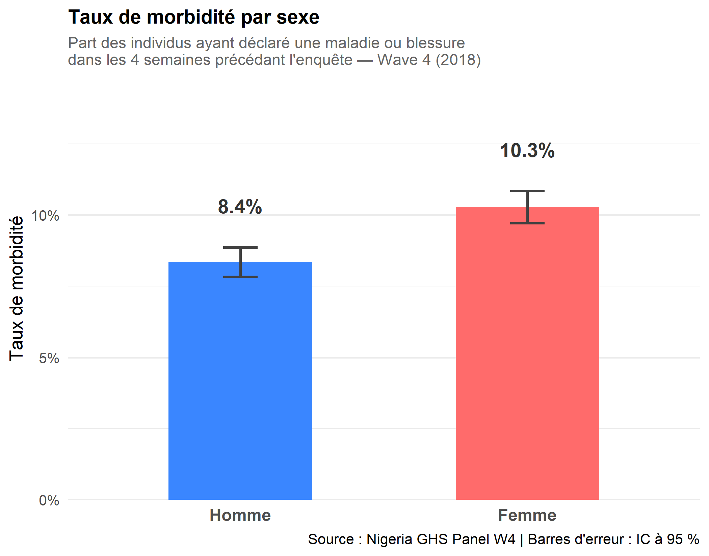
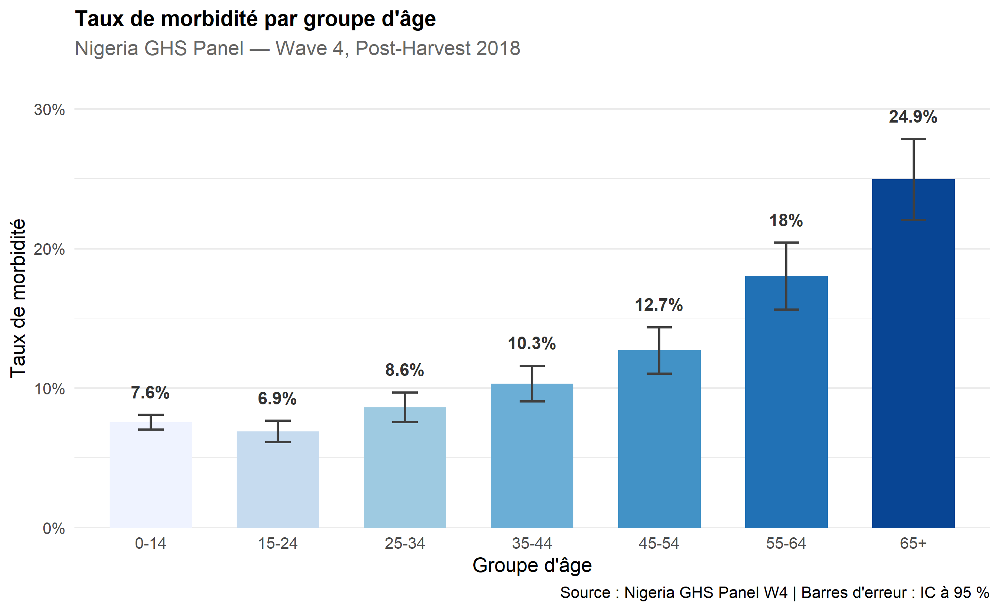
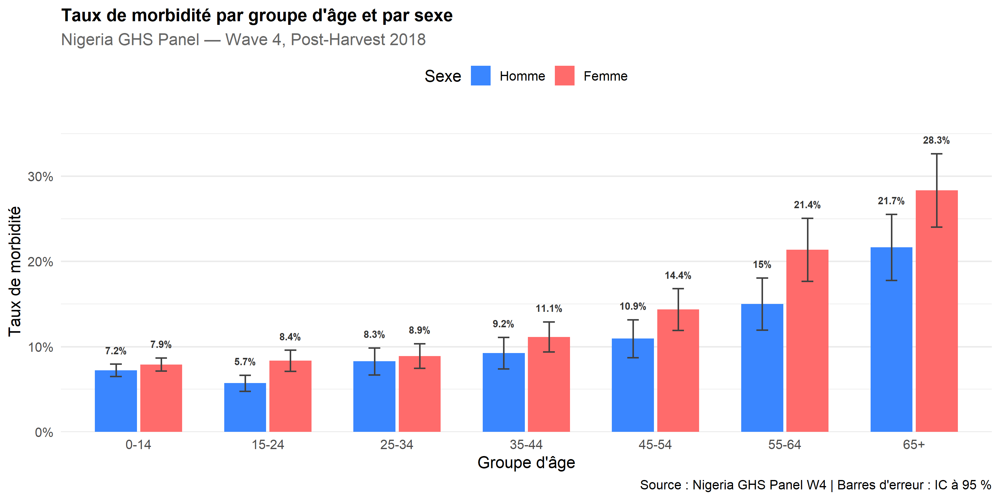
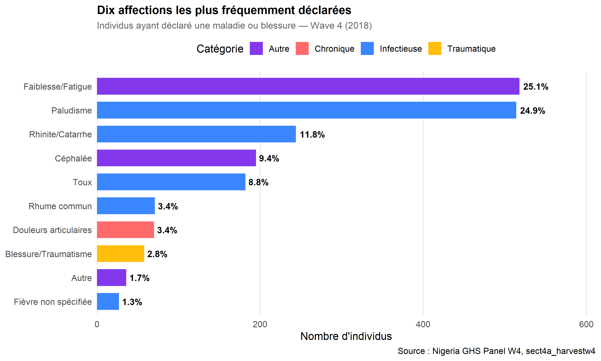
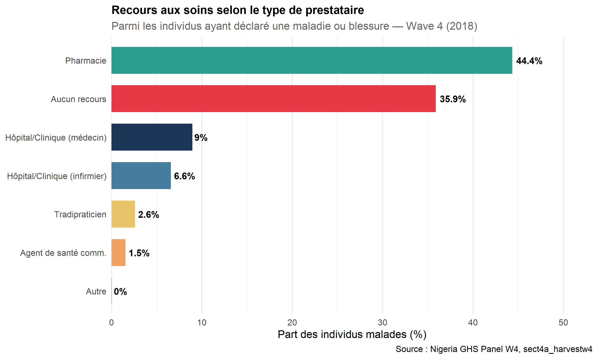
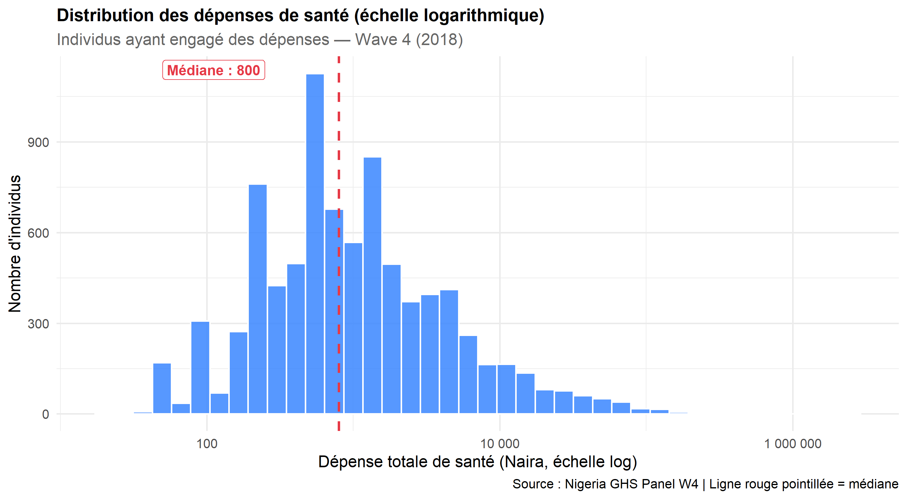
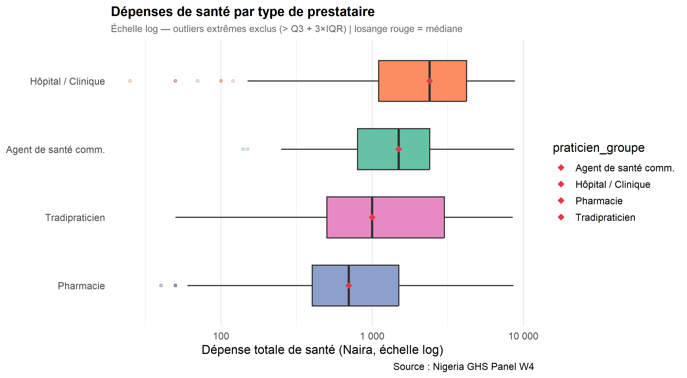
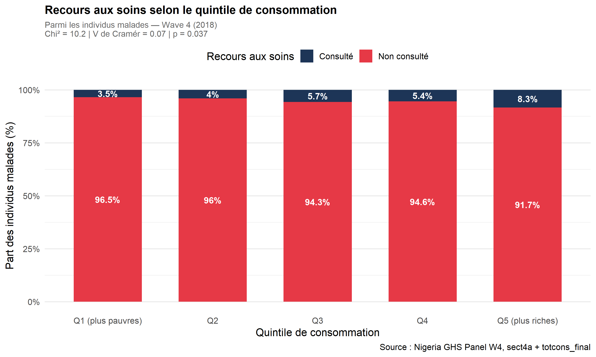
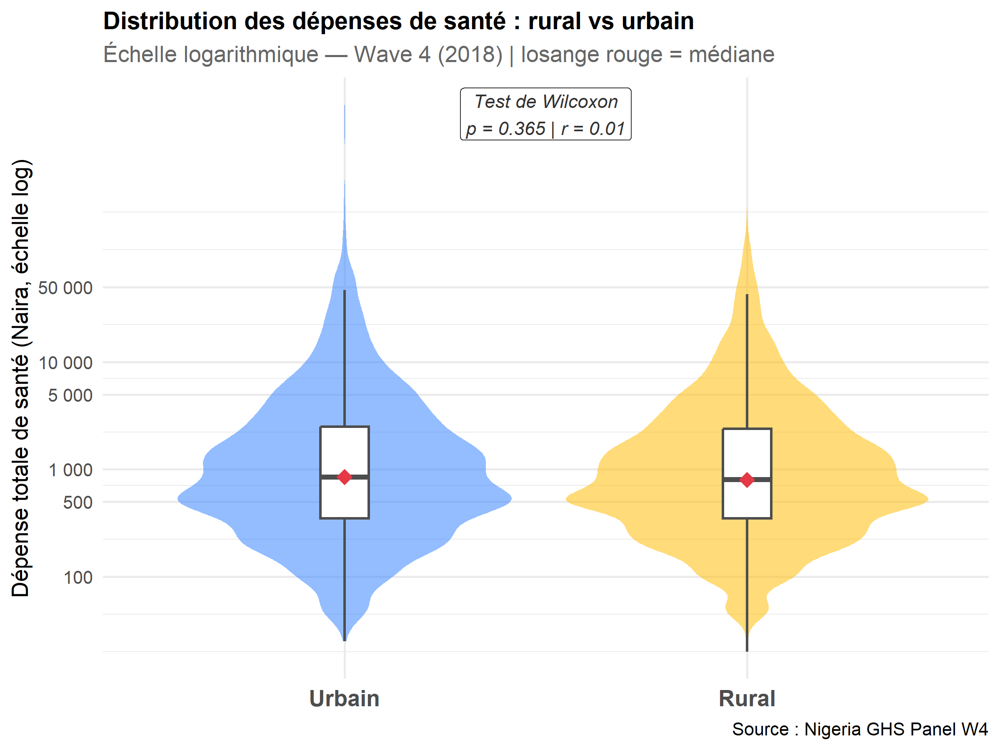

```{r setup, include=FALSE}
knitr::opts_chunk$set(
  echo      = FALSE,
  warning   = FALSE,
  message   = FALSE,
  fig.align = "center",
  out.width = "100%",
  # fig.pos = "H" force chaque figure à rester exactement là où
  # elle est appelée dans le code, sans flotter vers le bas de page.
  # Cela ne fonctionne qu'en PDF (ignoré silencieusement en HTML).
  # Requiert \usepackage{float} dans header-includes (voir YAML ci-dessus).
  fig.pos   = "H"
)
```

```{r valeurs, include=FALSE}
# Valeurs numériques issues de l'exécution des scripts 01 à 06
taux_global      <- 9.3
ic_global_low    <- 8.9
ic_global_high   <- 9.7
n_individus      <- 22171
n_malades        <- 2065
taux_homme       <- 8.4
taux_femme       <- 10.3
mediane_depenses <- 800
med_urbain       <- 850
med_rural        <- 800
chi2_val         <- 10.20
v_cramer         <- 0.070
p_chi2           <- 0.037
p_wilcoxon       <- 0.365
r_wilcoxon       <- 0.01
```

---

# Contexte et objectifs {-}

Le Nigeria figure parmi les pays à plus forte charge sanitaire d'Afrique subsaharienne.
Avec une couverture sanitaire universelle incomplète et de profondes disparités
socio-économiques, l'accès aux soins y reste inégalement réparti selon le milieu de
résidence, le sexe, l'âge et le niveau de richesse.

Ce rapport analyse les épisodes de maladie, les comportements de recours aux soins et
les dépenses de santé des ménages nigérians à partir des données du
**Nigeria General Household Survey (GHS) Panel, vague 4 (2018)**.
Il répond à six questions analytiques : le niveau de morbidité, les pathologies les
plus fréquentes, les prestataires de soins consultés, la distribution des dépenses,
le lien entre richesse et recours aux soins, et les disparités rurales/urbaines.


# Données et méthodologie

## Sources de données

L'analyse mobilise quatre fichiers issus de la vague Post-Harvest 2018 du GHS Panel,
programme LSMS-ISA de la Banque Mondiale :

| Fichier | Contenu | Variables mobilisées |
|---|---|---|
| `sect4a_harvestw4` | Section santé individuelle | Morbidité, recours aux soins, dépenses |
| `sect1_harvestw4` | Démographie | Sexe, âge, milieu de résidence |
| `secta_harvestw4` | Caractéristiques du ménage | Localisation (urbain/rural), État |
| `totcons_final` | Agrégat de consommation | Dépense par tête ajustée (quintile) |

L'enquête couvre **`r format(n_individus, big.mark=" ")` individus de 5 ans et plus**.
La jointure entre fichiers est réalisée sur les identifiants ménage (`hhid`) et
individu (`indiv`).

**Note :** Dans le GHS Wave 4, les variables de santé se trouvent dans `sect4a`
(et non `sect3a` comme dans les vagues antérieures). Les correspondances sont :
`s4aq3` = maladie/blessure, `s4aq6a` = praticien consulté,
`s4aq9/14/17` = dépenses de santé.

## Méthodes statistiques

Les méthodes utilisées sont exclusivement descriptives et inférentielles,
sans modélisation.

**Taux de morbidité.** La morbidité est mesurée comme la proportion d'individus
ayant déclaré au moins une maladie ou blessure dans les quatre semaines précédant
l'enquête (`s4aq3 = 1`). Les intervalles de confiance à 95% sont calculés par
l'approximation de Wilson :

$$\text{IC}_{95\%} = \hat{p} \pm 1{,}96 \sqrt{\frac{\hat{p}(1-\hat{p})}{n}}$$

**Classement des pathologies.** Les types d'affections (`s4aq3b_1`) sont classés par
fréquence et regroupés en trois catégories cliniques : *infectieuse*, *chronique*
et *traumatique*, selon le codebook du questionnaire.

**Analyse du recours aux soins.** Le type de praticien consulté (`s4aq6a`) est recodé
en cinq groupes : *hôpital/clinique*, *pharmacie*, *tradipraticien*, *agent de santé
communautaire* et *aucun recours*.

**Distribution des dépenses.** La dépense totale de santé additionne trois postes :
consultation (`s4aq9`), médicaments (`s4aq14`) et hospitalisation (`s4aq17`).
L'histogramme est tracé en échelle logarithmique, adaptée à cette distribution
fortement asymétrique. Les valeurs aberrantes sont identifiées par la règle de
Tukey étendue :

$$\text{Seuil} = Q_3 + 3 \times (Q_3 - Q_1)$$

**Test d'indépendance.** L'association entre recours aux soins et quintile de
consommation est testée par le **chi-deux de Pearson**. La force de l'association
est mesurée par le **V de Cramér** :

$$V = \sqrt{\frac{\chi^2}{n \times (\min(r, c) - 1)}}$$

**Comparaison rural/urbain.** La comparaison des dépenses médianes est réalisée par
le **test de Wilcoxon-Mann-Whitney**. La taille d'effet est mesurée par le $r$ de
Rosenthal :

$$r = \frac{|Z|}{\sqrt{n}}$$


# Résultats

## Morbidité déclarée : niveau global et disparités

Sur l'ensemble de l'échantillon, **`r taux_global`%** des individus ont déclaré au
moins une maladie ou blessure dans les quatre semaines précédant l'enquête
(IC 95% : [`r ic_global_low`% ; `r ic_global_high`%]), soit
**`r format(n_malades, big.mark=" ")` individus malades** sur les
`r format(n_individus, big.mark=" ")` enquêtés.

Deux disparités structurelles sont mises en évidence. Par sexe, les femmes présentent
un taux de morbidité plus élevé (`r taux_femme`%) que les hommes (`r taux_homme`%),
un écart observé dans tous les groupes d'âge adultes. Par groupe d'âge, la morbidité
suit une progression quasi-monotone : elle est la plus faible chez les jeunes adultes
(15-24 ans) et la plus élevée chez les personnes de 65 ans et plus.

```{r fig1a, fig.cap="Taux de morbidité par sexe avec IC à 95%. Source : Nigeria GHS Panel W4."}

```

```{r fig1b, fig.cap="Taux de morbidité par groupe d'âge avec IC à 95%. Source : Nigeria GHS Panel W4."}

```

```{r fig1c, fig.cap="Taux de morbidité croisé sexe x groupe d'âge. Source : Nigeria GHS Panel W4."}

```

## Profil des pathologies déclarées

La figure ci-dessous présente les dix affections les plus fréquemment déclarées, classées par
ordre croissant d'effectif et colorées selon leur catégorie clinique.

```{r fig2, fig.cap="Dix affections les plus fréquentes parmi les individus malades. Source : Nigeria GHS Panel W4."}

```

La faiblesse/fatigue (27,0%) et le paludisme (26,8%) dominent quasi à égalité et
représentent ensemble plus de la moitié des cas déclarés. Les maladies infectieuses
concentrent la majorité de la charge morbide, confirmant le contexte épidémiologique
du Nigeria. Les pathologies chroniques et traumatiques sont minoritaires dans les
déclarations spontanées --- un résultat probablement sous-estimé, ces affections
étant moins susceptibles d'être perçues comme des maladies au sens de l'enquête.

## Recours aux soins : qui consulte et où ?

La figure ci-après décrit la fréquence de consultation selon le type de prestataire parmi
les individus ayant déclaré une maladie ou blessure.

```{r fig3, fig.cap="Recours aux soins par type de prestataire parmi les individus malades. Source : Nigeria GHS Panel W4."}

```

Le résultat le plus saillant est la **prédominance du non-recours** : 35,9% des
individus malades ne consultent aucun praticien, ce qui révèle des barrières d'accès
importantes (coût, distance, manque de confiance). Parmi ceux qui consultent,
la pharmacie constitue le premier recours (44,4%), devant les hôpitaux et cliniques
(15,5%). Ce résultat est cohérent avec la littérature sur l'automédication en Afrique
subsaharienne : l'achat direct de médicaments permet d'éviter le coût et le délai
d'une consultation médicale formelle. Le tradipraticien (2,6%) et les agents de
santé communautaires (1,5%) représentent des recours marginaux.

## Distribution des dépenses de santé

La distribution des dépenses est **fortement asymétrique à droite** : la médiane
s'établit à **`r mediane_depenses` Naira** (Q1 = 350, Q3 = 2 500), avec une
queue droite s'étendant jusqu'à plusieurs millions de Naira pour les cas
d'hospitalisation. L'échelle logarithmique est indispensable pour visualiser
cette distribution. La figure ci-dessous montre que les dépenses liées à
l'hospitalisation sont les plus élevées et les plus dispersées entre prestataires.

```{r fig4a, fig.cap="Distribution des dépenses de santé -- échelle logarithmique. Source : Nigeria GHS Panel W4."}

```

```{r fig4b, fig.cap="Dépenses par type de prestataire -- échelle log, outliers extrêmes exclus. Source : Nigeria GHS Panel W4."}

```

## Inégalités socio-économiques d'accès aux soins

La figure suivante met en évidence un **gradient socio-économique clair** dans le recours
aux soins. Le taux de consultation passe de 3,5% dans le quintile le plus pauvre (Q1)
à 8,3% dans le plus riche (Q5), soit une progression de plus du double.

```{r fig5, fig.cap="Recours aux soins selon le quintile de consommation. Source : Nigeria GHS Panel W4."}

```

Le test du chi-deux confirme que cette association est statistiquement significative :
$\chi^2(4) =$ `r chi2_val`, $p =$ `r p_chi2`. Le V de Cramér ($V =$ `r v_cramer`)
indique une association faible mais réelle. Ces résultats révèlent une inégalité
structurelle : les ménages les plus pauvres sont précisément ceux qui consultent
le moins, créant un cercle vicieux entre pauvreté et accumulation de pathologies
non traitées.

## Comparaison rural/urbain des dépenses

La figure ci-après compare la distribution des dépenses de santé entre zones rurales et
urbaines à l'aide d'un violin plot superposé à un boxplot, sur échelle logarithmique.

```{r fig6, fig.cap="Distribution des dépenses de santé : rural vs urbain -- échelle logarithmique. Source : Nigeria GHS Panel W4."}

```

Les médianes sont proches (`r med_urbain` Naira en urbain vs `r med_rural` Naira
en rural). Le test de Wilcoxon-Mann-Whitney confirme l'absence de différence
statistiquement significative ($W =$ 7 723 916 ; $p =$ `r p_wilcoxon` ;
$r =$ `r r_wilcoxon`). Ce résultat contre-intuitif s'explique par la structure du
recours aux soins : en milieu rural, on consulte moins souvent, mais quand on le
fait, les dépenses engagées sont comparables à celles du milieu urbain. C'est donc
le *taux d'accès* qui diffère entre milieux, et non le coût unitaire des soins.

\newpage

# Synthèse

```{r tableau_synthese}
df_synth <- data.frame(
  Indicateur = c(
    "Taux de morbidité global",
    "Taux de morbidité -- Femmes",
    "Taux de morbidité -- Hommes",
    "Première affection déclarée",
    "Taux de non-recours aux soins",
    "Premier prestataire consulté",
    "Médiane des dépenses de santé",
    "Test chi-deux (recours x quintile)",
    "Test Wilcoxon (dépenses rural/urbain)"
  ),
  Valeur = c(
    "9,3% [IC 95% : 8,9-9,7%]",
    "10,3%",
    "8,4%",
    "Faiblesse/Fatigue (27,0%) et Paludisme (26,8%)",
    "35,9% des individus malades",
    "Pharmacie (44,4%)",
    "800 Naira (Q1=350, Q3=2 500)",
    "chi2=10,20 ; p=0,037 ; V=0,070 (association faible)",
    "p=0,365 ; r=0,01 (non significatif)"
  )
)

knitr::kable(
  df_synth,
  col.names = c("Indicateur", "Résultat"),
  caption   = paste0("Récapitulatif des principaux indicateurs",
                     " -- Nigeria GHS Panel W4 (2018)")
)
```

Cette analyse conduit à cinq constats principaux :

**1. Une morbidité modérée mais inégalement répartie.** Environ 9,3% des individus
déclarent une maladie ou blessure. La charge est plus lourde chez les femmes et
progresse fortement avec l'âge.

**2. Un profil épidémiologique dominé par les maladies infectieuses.** Le paludisme
et les syndromes d'affaiblissement général dominent les déclarations, en cohérence
avec le profil épidémiologique d'un pays tropical à revenu intermédiaire inférieur.

**3. Un recours aux soins largement informel.** Plus d'un tiers des malades ne
consulte personne, et près de la moitié s'oriente vers la pharmacie sans prescription
médicale.

**4. Des inégalités socio-économiques d'accès confirmées.** Le gradient de consultation
selon le quintile de richesse, validé statistiquement, témoigne de barrières
financières à l'accès aux soins formels.

**5. Une absence de différence significative des dépenses rural/urbain.** C'est le
taux d'accès qui varie selon le milieu, pas le coût unitaire des soins.


# Références bibliographiques {-}

- World Bank (2019). *Nigeria General Household Survey Panel 2018-2019, Wave 4*.
  LSMS-ISA. Washington DC : The World Bank.

- Deaton, A. (1997). *The Analysis of Household Surveys: A Microeconometric Approach
  to Development Policy*. Baltimore : Johns Hopkins University Press.

- Gwatkin, D.R. et al. (2007). *Socio-Economic Differences in Health, Nutrition, and
  Population within Developing Countries*. Washington DC : World Bank.

---

*Rapport produit avec R Markdown dans le cadre du cours de Projet Statistique
sous R et Python -- ENSAE, 2025-2026.*
