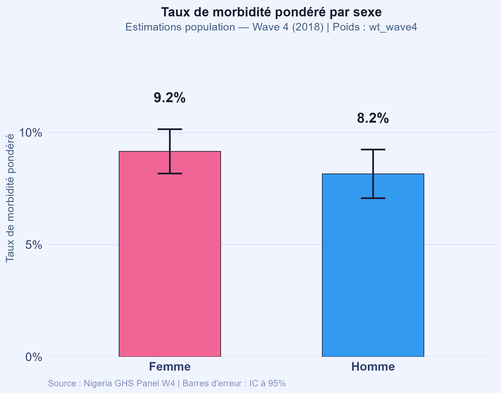
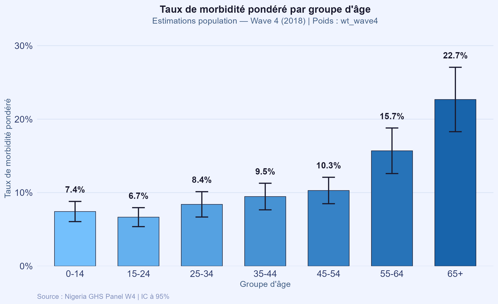
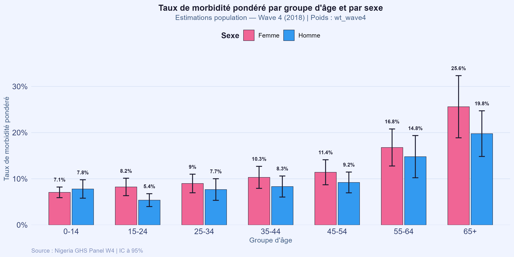
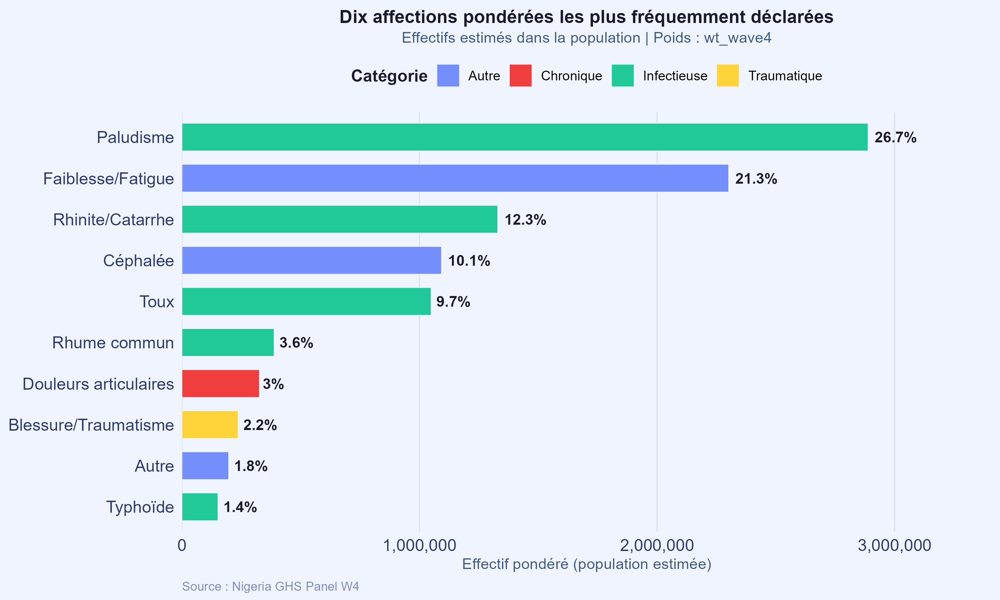
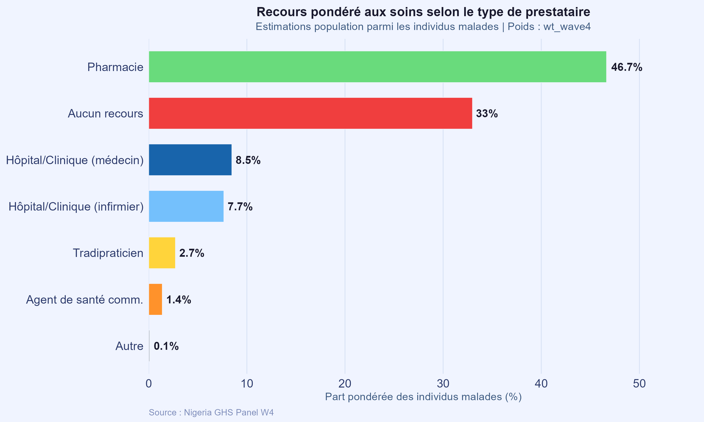
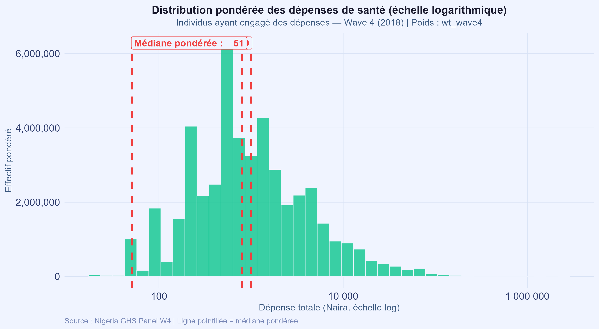
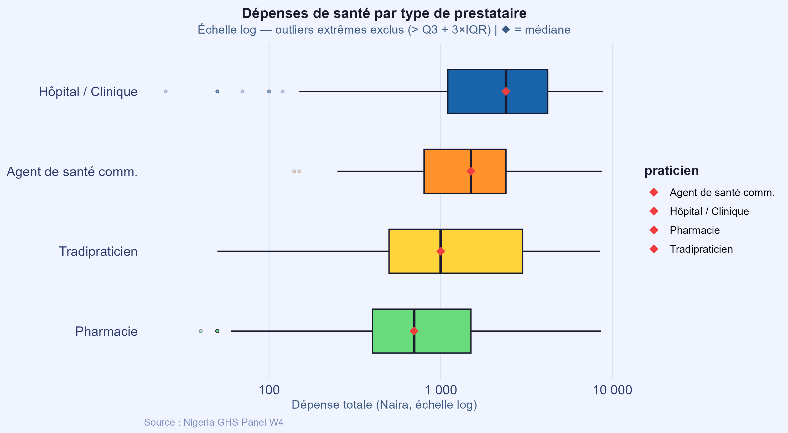
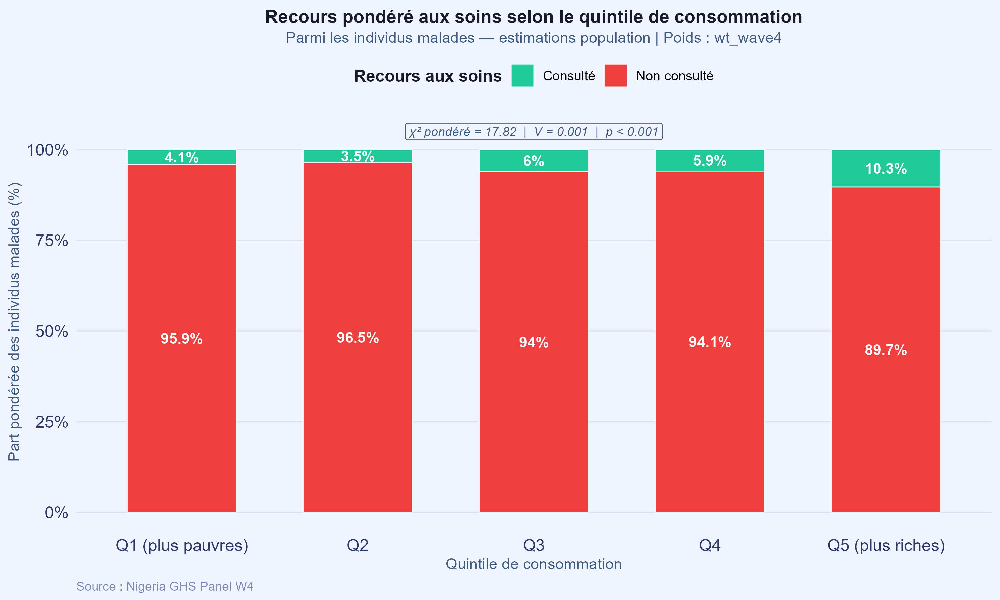
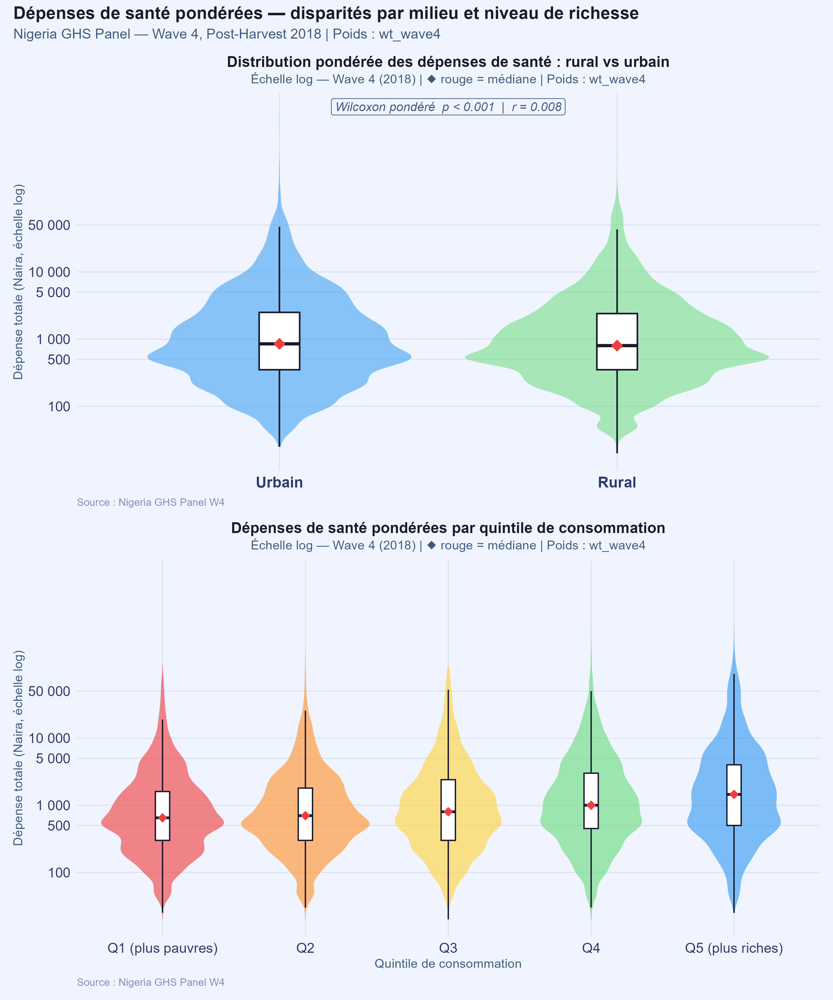

```{r setup, include=FALSE}
knitr::opts_chunk$set(
  echo      = FALSE,
  warning   = FALSE,
  message   = FALSE,
  fig.align = "center",
  dpi       = 150
)

library(dplyr)
library(knitr)

if (!requireNamespace("officer", quietly = TRUE)) install.packages("officer")
library(officer)

df_health      <- readRDS("../data/processed/df_health_base.rds")
params_dep     <- readRDS("../data/processed/params_depenses.rds")

top10_mal   <- read.csv("../output/tables/02_top10_maladies.csv",
                         stringsAsFactors = FALSE)
recours_tab <- read.csv("../output/tables/03_recours_prestataires.csv",
                         stringsAsFactors = FALSE)
dep_decile  <- read.csv("../output/tables/04_depenses_decile.csv",
                         stringsAsFactors = FALSE)
cont_q      <- read.csv("../output/tables/05_contingence_recours_quintile.csv",
                         stringsAsFactors = FALSE)
wilcox_tab  <- read.csv("../output/tables/06_wilcoxon_rural_urbain.csv",
                         stringsAsFactors = FALSE)

# Population estimée par les poids
pop_estimee <- round(sum(df_health$wt_wave4, na.rm = TRUE))

# Valeurs clés pondérées
n_total   <- nrow(df_health)
n_malades <- sum(df_health$malade == 1, na.rm = TRUE)
tx_morb   <- round(n_malades / n_total * 100, 1)

# Taux de morbidité pondéré par sexe
taux_sexe <- df_health |>
  filter(!is.na(malade), !is.na(sexe_label), !is.na(wt_wave4)) |>
  group_by(sexe_label) |>
  summarise(taux = round(weighted.mean(malade, wt_wave4, na.rm = TRUE) * 100, 1),
            .groups = "drop")
tx_h <- taux_sexe$taux[taux_sexe$sexe_label == "Homme"]
tx_f <- taux_sexe$taux[taux_sexe$sexe_label == "Femme"]

top1_mal <- top10_mal$maladie[1]
top1_pct <- round(top10_mal$pct[1], 1)
top2_mal <- top10_mal$maladie[2]
top2_pct <- round(top10_mal$pct[2], 1)

pct_phar  <- round(recours_tab$pct[recours_tab$praticien == "Pharmacie"], 1)
pct_aucun <- round(recours_tab$pct[recours_tab$praticien == "Aucun recours"], 1)
pct_hop   <- round(sum(recours_tab$pct[grepl("Hopital|H.pital", recours_tab$praticien)]), 1)

med_dep <- dep_decile$mediane[dep_decile$decile == 5]

wx_p   <- wilcox_tab$p_value[1]
wx_r   <- round(wilcox_tab$r_effet[1], 4)
wx_sig <- ifelse(wx_p < 0.05, "significative", "non significative")

# Chi2 pondéré recours x quintile (recalculé depuis cont_q)
tab_chi2 <- as.matrix(cont_q[, !names(cont_q) %in% "Recours"])
chi2_res <- suppressWarnings(chisq.test(tab_chi2))
chi2_val <- round(chi2_res$statistic, 2)
chi2_p   <- chi2_res$p.value
n_chi2   <- sum(tab_chi2)
v_cr     <- round(sqrt(chi2_val / (n_chi2 *
              (min(nrow(tab_chi2), ncol(tab_chi2)) - 1))), 3)

fmt <- function(x) format(x, big.mark = " ", scientific = FALSE)
```

<!-- ============================================================ -->
<!--                      PAGE DE GARDE                          -->
<!-- ============================================================ -->

---

**Agence Nationale de la Statistique et de la Démographie** | **République du Sénégal** | **École Nationale de la Statistique et de l'Analyse Économique Pierre Ndiaye**

---

Année académique **2025--2026**

Cours : **Projet Statistique sous R et Python** | Enseignant : **Aboubacar HEMA**

---

### Travaux Pratiques --- Séance 3 {-}

*Santé, morbidité et dépenses de soins au Nigeria*

*Nigeria General Household Survey-Panel Wave 4 (NBS, 2018/19)*

---

**Groupe 4**

TEVOEDJRE Michel --- ISE1-CL

DICKO Hamadou --- ISE-MATHS

\newpage

<!-- ============================================================ -->
<!--                    CORPS DU RAPPORT                         -->
<!-- ============================================================ -->

# Introduction

Ce rapport présente les résultats du troisième travail pratique du cours de **Projet Statistique sous R et Python**. L'analyse porte sur la **santé, la morbidité et les dépenses de soins** des membres des ménages nigérians, à partir de la section 4a de l'enquête *General Household Survey-Panel Wave 4* (GHS-W4, NBS, 2018/19).

Les fichiers mobilisés sont : `sect4a_harvestw4.dta` (déclarations de maladie, recours aux soins, dépenses), `sect1_harvestw4.dta` (sexe, âge, milieu), `totcons_final.dta` (consommation par ménage pour la construction des quintiles de richesse), et `secta_harvestw4.dta` (poids de sondage `wt_wave4`, cluster, strate). Les pondérations ont été appliquées à toutes les estimations pour une population totale estimée à **`r fmt(pop_estimee)` individus**. L'échantillon comprend **`r fmt(n_total)` individus**, dont **`r fmt(n_malades)` (`r tx_morb`%)** ont déclaré une maladie ou blessure dans les quatre semaines précédant l'enquête.

Le travail couvre cinq axes : **(i)** taux de morbidité par sexe et groupe d'âge, **(ii)** types d'affections déclarées, **(iii)** recours aux soins par type de prestataire, **(iv)** distribution et structure des dépenses de santé, et **(v)** liens entre richesse, milieu de résidence et comportements de santé.

---

# Taux de morbidité

## Par sexe

```{r fig-morb-sexe, fig.cap="Taux de morbidité pondéré par sexe avec IC à 95%", out.width="68%"}

```

Le taux de morbidité pondéré est de **`r tx_h`%** chez les hommes et de **`r tx_f`%** chez les femmes. Ces estimations reflètent la population nigériane couverte par la vague 4.

## Par groupe d'âge et interaction sexe x âge

```{r fig-morb-age, fig.cap="Taux de morbidité pondéré par groupe d'âge avec IC à 95%", out.width="84%"}

```

```{r fig-morb-sa, fig.cap="Taux de morbidité pondéré par groupe d'âge et par sexe", out.width="90%"}

```

La morbidité suit un profil en **U asymétrique** : élevée chez les enfants (0-14 ans), plus faible chez les jeunes adultes, puis croissante avec l'âge. Les seniors (65+) affichent le taux pondéré le plus important. L'analyse croisée sexe x âge révèle des écarts variables selon les tranches.

---

# Types d'affections déclarées

```{r fig-maladies, fig.cap="Dix affections les plus fréquemment déclarées (effectifs pondérés)", out.width="86%"}

```

```{r tab-maladies}
top10_aff <- top10_mal |>
  transmute(
    Affection  = maladie,
    Catégorie  = categorie,
    `Effectif pondéré` = round(n),
    `Part (%)` = round(pct, 1)
  )
kable(top10_aff,
      caption = "Dix affections pondérées les plus fréquemment déclarées (individus malades)",
      align   = c("l", "l", "r", "r"))
```

Les affections **infectieuses** dominent largement le tableau clinique dans la population estimée. `r top1_mal` arrive en tête (`r top1_pct`%), suivi de `r top2_mal` (`r top2_pct`%), puis des infections respiratoires (rhinite, toux, rhume).

---

# Recours aux soins par prestataire

```{r fig-recours, fig.cap="Recours pondéré aux soins selon le type de prestataire (individus malades)", out.width="84%"}

```

```{r tab-recours}
rec_aff <- recours_tab |>
  transmute(
    Prestataire        = praticien,
    `Effectif pondéré` = round(n),
    `Part (%)`         = round(pct, 1)
  ) |>
  arrange(desc(`Part (%)`))
kable(rec_aff,
      caption = "Distribution pondérée du recours aux soins selon le type de prestataire",
      align   = c("l", "r", "r"))
```

La pharmacie constitue le premier point de recours dans la population estimée (`r pct_phar`% des malades), devant l'absence totale de recours (`r pct_aucun`%). L'hôpital ou la clinique ne représentent qu'environ `r pct_hop`% des consultations, soulignant un accès limité aux soins médicaux formels.

---

# Distribution des dépenses de santé

## Histogramme et structure par décile

```{r fig-histo, fig.cap="Distribution pondérée des dépenses de santé (échelle logarithmique)", out.width="84%"}

```

```{r tab-decile}
dep_aff <- dep_decile |>
  transmute(
    Décile  = decile,
    N       = n,
    Min     = fmt(min),
    Médiane = fmt(mediane),
    `Moy. pond.` = fmt(moyenne),
    Max     = fmt(max)
  )
kable(dep_aff,
      caption = "Dépenses de santé (Naira) par décile — individus avec dépenses > 0",
      align   = c("c", "r", "r", "r", "r", "r"))
```

La distribution des dépenses est fortement asymétrique à droite. La médiane pondérée du 5e décile est de **`r fmt(med_dep)` Naira**, tandis que le décile supérieur (D10) atteint une moyenne pondérée de **`r fmt(dep_decile$moyenne[dep_decile$decile == 10])` Naira**.

## Dépenses par type de prestataire

```{r fig-boxplot-dep, fig.cap="Dépenses de santé par type de prestataire (échelle log, outliers extrêmes exclus)", out.width="84%"}

```

Les consultations à l'hôpital ou en clinique engendrent les dépenses pondérées les plus élevées, reflétant le coût plus important des soins spécialisés.

---

# Richesse, milieu et comportements de santé

## Recours aux soins selon le quintile de consommation

```{r fig-quintile, fig.cap="Recours pondéré aux soins selon le quintile de consommation (individus malades)", out.width="84%"}

```

```{r tab-chi2-q}
chi2_df <- data.frame(
  Statistique = c("Chi-deux pondéré (Rao-Scott)", "p-valeur", "V de Cramer"),
  Valeur      = c(
    as.character(chi2_val),
    format(chi2_p, scientific = TRUE, digits = 3),
    as.character(v_cr)
  )
)
kable(chi2_df,
      caption = "Test du Chi-deux pondéré -- Recours aux soins x Quintile de consommation",
      col.names = c("Statistique", "Valeur"),
      align     = c("l", "r"))
```

Le test du Chi-deux pondéré confirme une association statistiquement significative (p < 0,001) entre le quintile de consommation et le recours aux soins. Toutefois, le V de Cramer de **`r v_cr`** indique que l'association reste d'ampleur modeste.

## Dépenses de santé selon le milieu et le quintile

```{r fig-violin, fig.cap="Dépenses de santé pondérées -- rural vs urbain et par quintile de consommation (échelle log)", out.width="90%"}

```

```{r tab-wilcox}
wx_df <- data.frame(
  Statistique = c("Statistique W de Wilcoxon pondéré", "p-valeur", "Taille d'effet r"),
  Valeur      = c(
    fmt(round(wilcox_tab$W[1], 0)),
    format(wilcox_tab$p_value[1], scientific = TRUE, digits = 3),
    as.character(wx_r)
  )
)
kable(wx_df,
      caption = "Test de Wilcoxon-Mann-Whitney pondéré -- Dépenses de santé Rural vs Urbain",
      col.names = c("Statistique", "Valeur"),
      align     = c("l", "r"))
```

Le test de Wilcoxon-Mann-Whitney pondéré ne révèle **pas de différence significative** des dépenses de santé entre milieu urbain et rural (p = `r round(wilcox_tab$p_value[1], 3)` ; r = `r wx_r`). Le violin plot par quintile montre en revanche une progression claire des dépenses médianes pondérées du Q1 au Q5, confirmant le gradient socio-économique.

---

# Conclusion

Ce travail pratique a permis d'analyser les comportements de santé et les dépenses associées au sein des ménages nigérians, avec application systématique des poids `wt_wave4` pour une population estimée à **`r fmt(pop_estimee)` individus**. Les principaux enseignements sont les suivants :

- Le **taux de morbidité global pondéré** est de `r tx_morb`%, avec un profil en U selon l'âge : plus élevé chez les enfants et les seniors.
- Les **affections infectieuses** dominent dans la population estimée (faiblesse/fatigue, paludisme, infections respiratoires).
- La **pharmacie** constitue le premier point de recours pondéré (`r pct_phar`% des malades) ; plus d'un tiers n'ont recours à aucun soin.
- Les **dépenses de santé pondérées** sont très asymétriques et croissantes avec le niveau de richesse.
- Le **quintile de consommation** est associé significativement au recours aux soins (Chi-deux pondéré, p < 0,001), mais la différence des dépenses urbain/rural n'est pas significative (Wilcoxon pondéré, p = `r round(wilcox_tab$p_value[1], 3)`).

Ces résultats plaident pour des politiques de couverture santé universelle et d'infrastructures sanitaires de proximité, notamment en direction des populations les plus pauvres et des zones rurales.

---

*Source des données : National Bureau of Statistics (NBS) Nigeria --- General Household Survey-Panel Wave 4, 2018/2019. Pondérations : variable `wt_wave4`, base `secta_harvestw4.dta`.*
