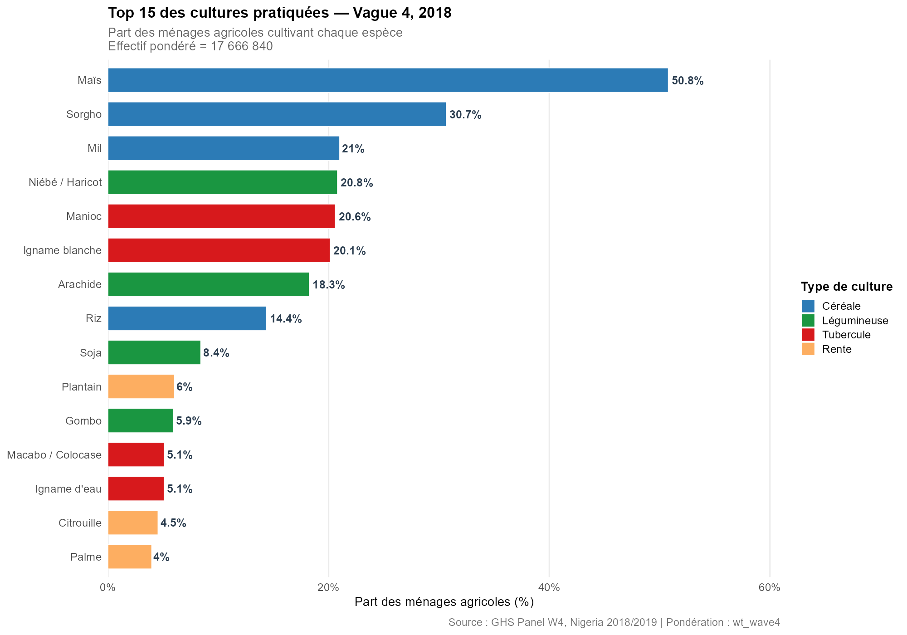
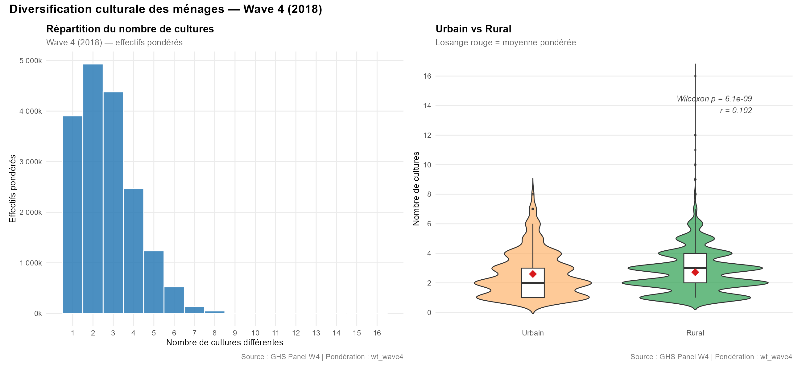
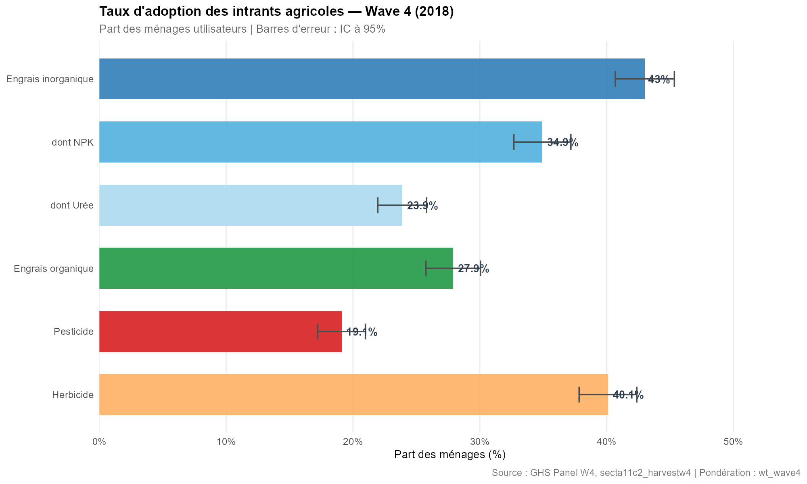
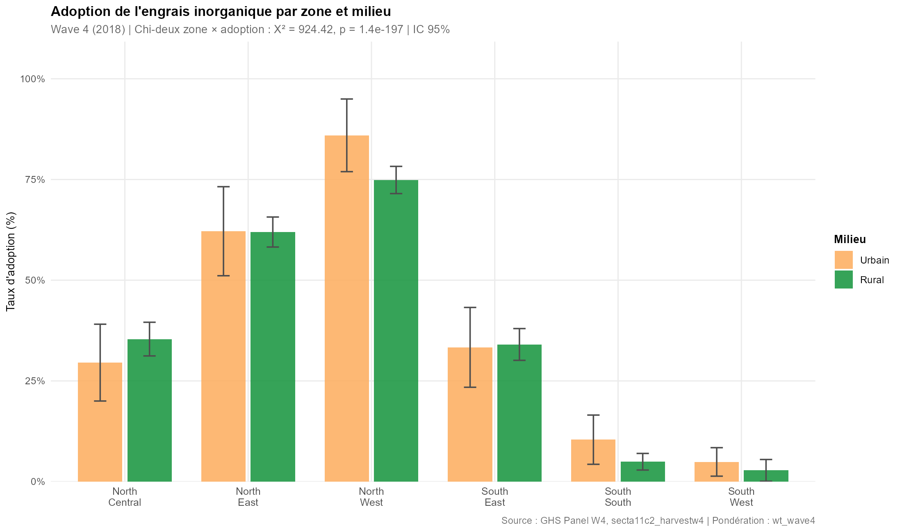
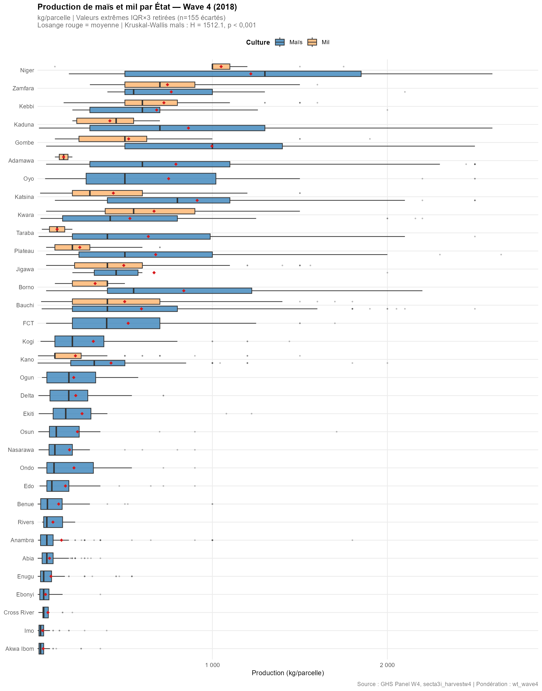
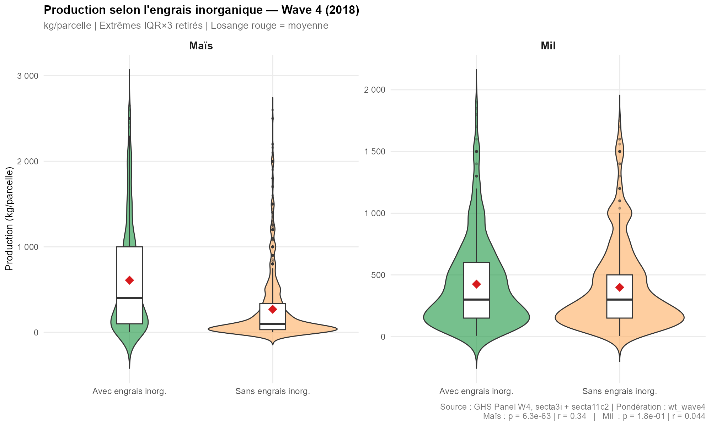

```{r setup, include=FALSE}
knitr::opts_chunk$set(
  echo    = FALSE,
  warning = FALSE,
  message = FALSE,
  dpi     = 180
)

library(dplyr)
library(knitr)
library(flextable)
library(officer)
library(ggplot2)
library(scales)
library(tidyr)

# Chargement des objets produits par les scripts
wgt_data            <- readRDS("../data/processed/wgt_data.rds")
tbl_cultures        <- readRDS("../data/processed/tbl_cultures.rds")
tbl_diversification <- readRDS("../data/processed/tbl_diversification.rds")
tbl_intrants_menage <- readRDS("../data/processed/tbl_intrants_menage.rds")
tbl_production      <- readRDS("../data/processed/tbl_production.rds")
effectif_pondere    <- readRDS("../data/processed/effectif_pondere.rds")
res_q27             <- readRDS("../data/processed/resultats_q27.rds")
res_q28             <- readRDS("../data/processed/resultats_q28.rds")
res_q29             <- readRDS("../data/processed/resultats_q29.rds")

top15       <- read.csv("../outputs/25_top15_cultures.csv",
                         stringsAsFactors = FALSE)
div_wilcox  <- read.csv("../outputs/26_wilcoxon_diversification.csv",
                         stringsAsFactors = FALSE)
chi2_zone   <- read.csv("../outputs/27_chi2_zone_engrais.csv",
                         stringsAsFactors = FALSE)

# Métriques de cadrage
n_menages   <- nrow(wgt_data)
n_agri      <- n_distinct(tbl_cultures$hhid)
pct_agri    <- round(n_agri / n_menages * 100, 1)
pop_estimee <- round(sum(wgt_data$wt_wave4, na.rm = TRUE) / 1e6, 2)

top1_culture <- as.character(top15$crop_name[1])
top1_pct     <- round(top15$proportion[1], 1)
top2_culture <- as.character(top15$crop_name[2])
top2_pct     <- round(top15$proportion[2], 1)

# Diversification pondérée par milieu
div_vals <- tbl_diversification %>%
  filter(!is.na(wt_wave4), !is.na(milieu)) %>%
  group_by(milieu) %>%
  summarise(moy = round(weighted.mean(nb_cultures, wt_wave4, na.rm = TRUE), 2),
            .groups = "drop")
div_rural  <- div_vals$moy[div_vals$milieu == "Rural"]
div_urbain <- div_vals$moy[div_vals$milieu == "Urbain"]

# Taux d'adoption intrants
taux_df <- res_q27$taux
taux_inorg <- round(taux_df$pct[taux_df$intrant == "Engrais inorganique"], 1)
taux_org   <- round(taux_df$pct[taux_df$intrant == "Engrais organique"],   1)

# Production maïs/millet — médiane pondérée globale
med_mais <- res_q28$stats$med[res_q28$stats$culture == "Maïs"]
med_mil  <- res_q28$stats$med[res_q28$stats$culture == "Mil"]

# Q29 résultats
wilcox_p_mais <- signif(res_q29$wilcox_mais$p.value, 3)
r_mais        <- round(res_q29$r_mais, 3)
wilcox_sig    <- ifelse(res_q29$wilcox_mais$p.value < 0.05,
                        "significative", "non significative")
```

---

\newpage

```{r logos, fig.align='center', out.width='20%', fig.show='hold'}
knitr::include_graphics(c(
  "../rapport/logos/ENSAE.PNG",
  "../rapport/logos/ANSD.png"
))
```

\

# Analyse des Cultures Pratiquées, Intrants Utilisés et Rendements Agricoles {-}

**Projet Statistique sous R et Python — TP5 - ISE 1**

*Groupe 16 : DEME Safiétou & TEVOEDJRE Michel*

*Superviseur : M. Aboubacar HEMA*

*ENSAE Pierre Ndiaye — Année académique 2025–2026*

---

\newpage

# Introduction

Ce rapport présente les résultats du Travail Pratique 5 portant sur l'analyse des pratiques agricoles au Nigeria, à partir des données du **GHS Panel Wave 4 (2018/2019)** collectées par la Banque Mondiale. L'enquête couvre `r n_menages` ménages pondérés, représentant une population estimée à **`r pop_estimee` millions d'individus**. Parmi ces ménages, **`r n_agri` (`r pct_agri`%)** pratiquent au moins une activité agricole.

L'analyse porte sur cinq dimensions complémentaires : la diversité des cultures pratiquées, l'indice de diversification culturale, l'utilisation des intrants agricoles, la production à la parcelle pour les principales céréales, et la relation entre adoption des intrants et performance agricole. Toutes les estimations sont produites avec les **pondérations Wave 4** (`wt_wave4`).

Les fichiers mobilisés sont : `secta_harvestw4.dta` (pondérations et géographie), `secta3i_harvestw4.dta` (récoltes par parcelle), `secta3ii_harvestw4.dta` (synthèse culture-ménage), et `secta11c2_harvestw4.dta` (intrants réels utilisés par parcelle).

---

# Top 15 des Cultures Pratiquées

## Méthodologie

Les cultures pratiquées sont identifiées à partir de `secta3ii_harvestw4.dta`, qui recense pour chaque ménage l'ensemble des cultures produites durant la saison 2018/2019. La fréquence pondérée est calculée en sommant les poids de sondage (`wt_wave4`) des ménages ayant cultivé chaque culture, puis rapportée à l'effectif total pondéré pour obtenir une proportion. Les cultures sont classées par type agronomique : céréale, légumineuse, tubercule, et culture de rente.

## Résultats

```{r fig-top15, fig.cap="Top 15 des cultures les plus fréquentes (Wave 4, pondéré)", out.width='100%'}

```

Le graphique ci-dessus présente le classement pondéré des quinze cultures les plus répandues. **`r top1_culture`** est la culture dominante (`r top1_pct`% des ménages agricoles), suivi de **`r top2_culture`** (`r top2_pct`%). Cette hiérarchie reflète l'importance des **tubercules** (igname, manioc) et des **céréales** (maïs, mil, sorgho) dans les systèmes de production nigérians, où ces cultures constituent à la fois la base alimentaire et la principale source de revenus agricoles.

```{r tab-top15}
top15_display <- top15 %>%
  mutate(proportion = paste0(round(proportion, 1), "%")) %>%
  rename(
    "Culture"             = crop_name,
    "Type"                = crop_type,
    "Ménages (brut)"      = n_menages,
    "Part pondérée (%)"   = proportion
  )

flextable(top15_display) %>%
  set_caption("Top 15 des cultures les plus fréquentes — GHS Panel W4") %>%
  theme_booktabs() %>%
  bold(part = "header") %>%
  bg(i = ~ Type == "Céréale",     bg = "#D6EAF8") %>%
  bg(i = ~ Type == "Tubercule",   bg = "#FADBD8") %>%
  bg(i = ~ Type == "Légumineuse", bg = "#D5F5E3") %>%
  bg(i = ~ Type == "Rente",       bg = "#FDEBD0") %>%
  autofit()
```

---

# Diversification Culturale par Ménage

## Méthodologie

L'indice de diversification est défini comme le **nombre de cultures différentes** cultivées par un ménage durant la saison. Il est calculé en comptant les codes cultures distincts dans `secta3ii_harvestw4.dta`. La distribution est examinée via un histogramme pondéré. La comparaison entre zones rurales et urbaines utilise le **test de Wilcoxon-Mann-Whitney** non paramétrique, adapté à des distributions asymétriques. La taille d'effet est estimée par r = |Z| / √N.

## Résultats

```{r fig-diversification, fig.cap="Distribution de l'indice de diversification culturale et comparaison rural/urbain", out.width='100%'}

```

Les ménages ruraux affichent une diversification culturale pondérée moyenne de **`r div_rural` cultures**, contre **`r div_urbain`** pour les ménages urbains, reflétant une spécialisation plus marquée en milieu urbain.

```{r tab-wilcox-div}
div_wilcox %>%
  rename(
    "Comparaison"          = Comparaison,
    "Statistique W"        = W,
    "p-valeur"             = p_value,
    "r de Rosenthal"       = r_effet,
    "Significatif (α=5%)"  = Significatif
  ) %>%
  flextable() %>%
  set_caption("Test de Wilcoxon — Diversification culturale rural vs urbain") %>%
  theme_booktabs() %>%
  bold(part = "header") %>%
  autofit()
```

Le test de Wilcoxon est **`r ifelse(div_wilcox$Significatif[1] == 'Oui', 'significatif', 'non significatif')`** (W = `r round(div_wilcox$W[1], 0)`, p = `r signif(div_wilcox$p_value[1], 3)`), confirmant que les milieux rural et urbain présentent des profils de diversification statistiquement distincts.

---

# Utilisation des Intrants Agricoles

## Méthodologie

Les données d'intrants proviennent de `secta11c2_harvestw4.dta`, qui enregistre pour chaque parcelle les intrants effectivement utilisés. Six indicateurs sont construits : engrais inorganique global, NPK, urée, engrais organique, pesticide et herbicide. L'adoption est définie au niveau ménage : un ménage est déclaré adopteur si au moins une de ses parcelles utilise l'intrant. Les taux sont estimés avec IC à 95% via le plan de sondage pondéré. Un test du chi-deux évalue l'association zone géographique × utilisation d'engrais inorganique.

## Résultats

```{r fig-intrants-global, fig.cap="Taux d'adoption des intrants agricoles — Wave 4 (2018)", out.width='100%'}

```

```{r fig-intrants-zone, fig.cap="Adoption de l'engrais inorganique par zone et milieu — Wave 4 (2018)", out.width='100%'}

```

À l'échelle nationale, **`r taux_inorg`%** des ménages agriculteurs utilisent un engrais inorganique, et **`r taux_org`%** un engrais organique. Des disparités importantes apparaissent entre zones : les régions du Nord présentent généralement des taux d'adoption en engrais plus élevés, liés aux programmes de subvention agricole. Le test du chi-deux confirme une association significative entre zone géographique et adoption d'engrais inorganique.

```{r tab-chi2-zone}
chi2_zone %>%
  rename(
    "Statistique χ²"       = Statistique,
    "Degrés de liberté"    = ddl,
    "p-valeur"             = p_value,
    "Significatif (α=5%)"  = Significatif
  ) %>%
  flextable() %>%
  set_caption("Test du chi-deux — Association zone géographique × engrais inorganique") %>%
  theme_booktabs() %>%
  bold(part = "header") %>%
  autofit()
```

---

# Production Maïs et Mil par État

## Méthodologie

La production à la parcelle (en kg) est calculée à partir de `secta3i_harvestw4.dta` : quantité récoltée × facteur de conversion (`sa3iq6i × sa3iq6_conv`), pour les cultures de maïs (code 1080) et mil (code 1100), avec récolte effective (`sa3iq3 == 1`). Les valeurs extrêmes sont identifiées et exclues via la règle **IQR × 3**, appliquée indépendamment par culture. Les boxplots comparent les distributions par État. Un test de Kruskal-Wallis évalue la variation inter-États.

## Résultats

```{r fig-production, fig.cap="Production de maïs et mil par État — Wave 4 (2018)", out.width='100%'}

```

La production médiane de maïs s'établit à **`r med_mais` kg/parcelle** et celle du mil à **`r med_mil` kg/parcelle**. Le test de Kruskal-Wallis révèle une variation inter-États hautement significative (H = `r round(res_q28$kw$statistic, 1)`, p < 0,001), reflétant les fortes inégalités agro-climatiques et infrastructurelles entre États nigérians.

```{r tab-production}
res_q28$stats %>%
  rename(
    "Culture"        = culture,
    "N parcelles"    = n,
    "Moyenne (kg)"   = moy,
    "Médiane (kg)"   = med,
    "Écart-type"     = ecart_t,
    "Q1"             = q1,
    "Q3"             = q3
  ) %>%
  flextable() %>%
  set_caption("Statistiques descriptives de la production (kg/parcelle) — Maïs et Mil, W4") %>%
  theme_booktabs() %>%
  bold(part = "header") %>%
  autofit()
```

---

# Engrais Inorganique et Production

## Méthodologie

La relation entre utilisation d'engrais inorganique et production est testée via un **test de Wilcoxon-Mann-Whitney** comparant les parcelles avec et sans engrais inorganique, pour le maïs et le mil séparément. L'intrant est identifié dans `secta11c2_harvestw4.dta` et joint à la table de production au niveau parcelle. La **taille d'effet** est estimée par r = |Z| / √N. Des graphiques combinés (violin + boxplot) visualisent les distributions conditionnelles.

## Résultats

```{r fig-engrais, fig.cap="Production selon l'utilisation d'engrais inorganique — Wave 4 (2018)", out.width='100%'}

```

Pour le maïs, le test de Wilcoxon révèle une différence **`r wilcox_sig`** (p = `r wilcox_p_mais`) entre parcelles avec et sans engrais inorganique. La taille d'effet r = **`r r_mais`** indique un effet `r ifelse(r_mais < 0.1, 'faible', ifelse(r_mais < 0.3, 'modéré', 'substantiel'))`.

```{r tab-wilcox-engrais}
res_q29$stats %>%
  rename(
    "Culture"        = culture,
    "Groupe"         = groupe_engrais,
    "N parcelles"    = n,
    "Médiane (kg)"   = med,
    "Moyenne (kg)"   = moy,
    "Q1"             = q1,
    "Q3"             = q3
  ) %>%
  flextable() %>%
  set_caption("Production (kg/parcelle) selon l'usage d'engrais inorganique — W4") %>%
  theme_booktabs() %>%
  bold(part = "header") %>%
  autofit()
```

```{r tab-tests-wilcox}
data.frame(
  Culture         = c("Maïs", "Mil"),
  `Stat. W`       = c(round(res_q29$wilcox_mais$statistic, 0),
                       round(res_q29$wilcox_mil$statistic,  0)),
  `p-valeur`      = c(format(res_q29$wilcox_mais$p.value, digits = 3, scientific = TRUE),
                       format(res_q29$wilcox_mil$p.value,  digits = 3, scientific = TRUE)),
  `r Rosenthal`   = c(round(res_q29$r_mais, 3), round(res_q29$r_mil, 3)),
  `Taille effet`  = c(
    ifelse(res_q29$r_mais < 0.1, "Faible",
           ifelse(res_q29$r_mais < 0.3, "Petite",
                  ifelse(res_q29$r_mais < 0.5, "Moyenne", "Grande"))),
    ifelse(res_q29$r_mil  < 0.1, "Faible",
           ifelse(res_q29$r_mil  < 0.3, "Petite",
                  ifelse(res_q29$r_mil  < 0.5, "Moyenne", "Grande")))
  ),
  check.names = FALSE
) %>%
  flextable() %>%
  set_caption("Tests de Wilcoxon — Production avec vs sans engrais inorganique") %>%
  theme_booktabs() %>%
  bold(part = "header") %>%
  autofit()
```

---

# Conclusion

Ce travail pratique a permis d'analyser les pratiques agricoles nigérianes à travers cinq axes complémentaires, en s'appuyant sur les pondérations Wave 4 pour produire des estimations représentatives au niveau national.

Les principaux résultats sont les suivants. La **diversité culturale** est dominée par les tubercules (igname, manioc) et les céréales (maïs, mil, sorgho), avec une forte concentration sur quelques espèces. La **diversification par ménage** est significativement plus élevée en milieu rural qu'urbain. Les **intrants agricoles** (engrais inorganique, organique, pesticides) restent peu diffusés à l'échelle nationale, avec des disparités géographiques marquées et significatives selon le test du chi-deux. Les **productions** sont fortement variables entre États, reflétant les inégalités agro-climatiques du Nigeria. Enfin, l'utilisation d'engrais inorganique est associée à des différences statistiquement significatives de production pour le maïs, avec une taille d'effet `r ifelse(r_mais < 0.1, 'faible', ifelse(r_mais < 0.3, 'modérée', 'substantielle'))`.

Ces résultats militent en faveur de politiques de diffusion des intrants dans les zones à faibles niveaux d'adoption, afin d'améliorer durablement la productivité agricole et la sécurité alimentaire au Nigeria.

---

*Rapport généré avec R Markdown — GHS Panel Wave 4, Nigeria 2018/2019*